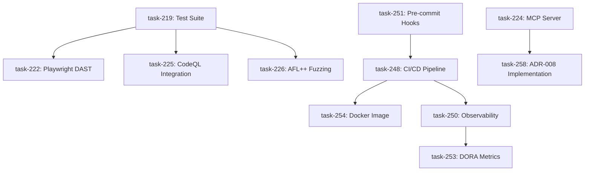

# Platform Plan: Muckross Security Infrastructure

**Host Assignment**: muckross
**Date**: 2025-12-04
**Platform Engineer**: @platform-engineer
**Version**: 1.0
**Tasks Covered**: 11 tasks (task-219, task-222, task-224, task-225, task-226, task-248, task-250, task-251, task-253, task-254, task-258)

---

## Executive Summary

This platform plan covers the infrastructure, CI/CD, testing, observability, and deployment architecture for the `/jpspec:security` commands. The muckross host is responsible for building and operating the security scanning platform that enables DORA Elite performance while maintaining comprehensive security coverage.

### Strategic Objectives

1. **DORA Elite Performance**: Maintain >1 deploy/day, <1hr lead time, <5% change failure rate, <1hr MTTR
2. **Platform Reliability**: 99.9% uptime for CI/CD security scanning
3. **Developer Experience**: <10 second pre-commit scans, <5 minute CI scans
4. **Observability**: Complete visibility into security posture, scan performance, and workflow impact
5. **Scalability**: Support 100+ projects, 1000+ scans/day

### Architecture Reference

- **PRD**: `docs/prd/jpspec-security-commands.md`
- **ADR-005**: Scanner Orchestration Pattern (Adapter Pattern + Service Activator)
- **ADR-008**: Security MCP Server Architecture (SOA + REST)
- **ADR-009**: CodeQL MCP Integration

### Task Domains

**Infrastructure & MCP** (4 tasks):
- task-224: Security Scanner MCP Server (HIGH)
- task-258: ADR-008 MCP Server Implementation (MEDIUM)
- task-248: CI/CD Security Scanning Pipeline (HIGH)
- task-254: Docker Image Build and Publish (LOW)

**Testing & DAST** (4 tasks):
- task-219: Test Suite Development (HIGH)
- task-222: Playwright DAST Implementation (HIGH)
- task-225: CodeQL Integration (MEDIUM)
- task-226: AFL++ Fuzzing Support (LOW)

**Observability** (3 tasks):
- task-250: Security Scanning Observability (MEDIUM)
- task-251: Pre-commit Hook Configuration (LOW)
- task-253: DORA Metrics Tracking (MEDIUM)

---

## 1. CI/CD Pipeline Architecture

### 1.1 GitHub Actions Workflow Design

**File**: `.github/workflows/security-scan.yml`

#### Workflow Inputs

```yaml
inputs:
  scan-type:
    description: 'Scan mode: incremental|full|fast'
    required: false
    default: 'incremental'
  fail-on:
    description: 'Fail on severity levels'
    required: false
    default: 'critical,high'
  upload-sarif:
    description: 'Upload SARIF to GitHub Security'
    required: false
    default: 'true'
  scanners:
    description: 'Scanners to run: semgrep,codeql,trivy'
    required: false
    default: 'semgrep'
```

#### Workflow Architecture

```
┌──────────────────────────────────────────────────────────────┐
│                    Security Scan Workflow                     │
│                                                               │
│  ┌─────────────┐  ┌─────────────┐  ┌─────────────┐          │
│  │   Checkout  │→ │Setup Python │→ │ Cache Tools │          │
│  └─────────────┘  └─────────────┘  └─────────────┘          │
│                                                               │
│  ┌───────────────────────────────────────────────┐           │
│  │        Parallel Scanner Execution             │           │
│  │  ┌──────────┐ ┌──────────┐ ┌──────────┐      │           │
│  │  │ Semgrep  │ │  CodeQL  │ │  Trivy   │      │           │
│  │  │ (2 min)  │ │ (8 min)  │ │ (3 min)  │      │           │
│  │  └──────────┘ └──────────┘ └──────────┘      │           │
│  └───────────────────────────────────────────────┘           │
│                           │                                   │
│  ┌────────────────────────▼────────────────────────┐         │
│  │         Result Aggregation & SARIF Upload       │         │
│  │  • Deduplicate findings                         │         │
│  │  • Upload to GitHub Security tab                │         │
│  │  • Generate PR comment                          │         │
│  └─────────────────────────────────────────────────┘         │
│                                                               │
│  ┌─────────────┐  ┌─────────────┐  ┌─────────────┐          │
│  │Upload SARIF │→ │  PR Comment │→ │Update Badges│          │
│  └─────────────┘  └─────────────┘  └─────────────┘          │
└──────────────────────────────────────────────────────────────┘
```

#### Performance Budget

| Scan Type | Target Time | Components | Cache Strategy |
|-----------|-------------|------------|----------------|
| Fast (pre-commit) | <10 seconds | Semgrep only, changed files | Aggressive file-level |
| Incremental (PR) | <5 minutes | Semgrep + Trivy, baseline diff | Git diff caching |
| Full (main branch) | <15 minutes | All scanners, full codebase | Tool binary caching |
| Deep (nightly) | <60 minutes | CodeQL dataflow, fuzzing | Database caching |

#### Caching Strategy

**Tool Binary Cache** (<50MB):
```yaml
- name: Cache Semgrep
  uses: actions/cache@v4
  with:
    path: ~/.local/bin/semgrep
    key: semgrep-${{ runner.os }}-1.50.0
```

**CodeQL Database Cache** (up to 2GB):
```yaml
- name: Cache CodeQL Database
  uses: actions/cache@v4
  with:
    path: .codeql/database
    key: codeql-${{ github.sha }}
    restore-keys: |
      codeql-${{ github.base_ref }}-
```

**Scan Results Cache** (incremental mode):
```yaml
- name: Cache Baseline Scan
  uses: actions/cache@v4
  with:
    path: .specify/security/baseline-*.json
    key: security-baseline-${{ github.event.pull_request.base.sha }}
```

#### Matrix Strategy for Large Codebases

For projects >100K LOC, split scanning by component:

```yaml
strategy:
  fail-fast: false
  matrix:
    component:
      - name: backend-python
        path: src/backend
        scanners: semgrep,bandit
      - name: frontend-typescript
        path: src/frontend
        scanners: semgrep,eslint-plugin-security
      - name: infrastructure-terraform
        path: infra
        scanners: trivy,checkov
```

Each matrix job uploads SARIF with unique category for GitHub Security tab separation.

#### SARIF Upload Configuration

```yaml
- name: Upload SARIF to GitHub Security
  uses: github/codeql-action/upload-sarif@v3
  with:
    sarif_file: docs/security/scan-results.sarif
    category: jpspec-security-${{ matrix.component.name || 'default' }}
    checkout_path: ${{ github.workspace }}
  env:
    GITHUB_TOKEN: ${{ secrets.GITHUB_TOKEN }}
```

**Required Permissions**:
```yaml
permissions:
  contents: read
  security-events: write
  pull-requests: write
```

#### PR Comment Bot

Generate actionable PR comments with fix suggestions:

```yaml
- name: Comment on PR
  uses: actions/github-script@v7
  with:
    script: |
      const fs = require('fs');
      const results = JSON.parse(fs.readFileSync('docs/security/scan-results.json'));

      const summary = `## Security Scan Results

      | Severity | Count |
      |----------|-------|
      | Critical | ${results.critical || 0} |
      | High | ${results.high || 0} |
      | Medium | ${results.medium || 0} |
      | Low | ${results.low || 0} |

      <details>
      <summary>Fix Suggestions</summary>

      ${results.findings.slice(0, 5).map(f => `
      ### ${f.title}
      **File**: ${f.location.path}:${f.location.start_line}
      **Fix**: ${f.fix_suggestion || 'See details in Security tab'}
      `).join('\n')}

      </details>
      `;

      github.rest.issues.createComment({
        issue_number: context.issue.number,
        owner: context.repo.owner,
        repo: context.repo.repo,
        body: summary
      });
```

#### DevSecOps Integration

**Security Gate Logic**:
```yaml
- name: Security Gate
  run: |
    CRITICAL=$(jq '.summary.critical' docs/security/scan-results.json)
    HIGH=$(jq '.summary.high' docs/security/scan-results.json)

    if [ "$CRITICAL" -gt 0 ]; then
      echo "❌ BLOCKED: $CRITICAL critical vulnerabilities found"
      exit 1
    fi

    if [ "$HIGH" -gt 5 ]; then
      echo "⚠️  WARNING: $HIGH high-severity vulnerabilities found"
      echo "Consider addressing before merge"
    fi
```

**Compliance Attestation**:
- Generate SLSA provenance for security scan execution
- Store attestation in GitHub attestations API
- Include scanner versions, ruleset hashes, scan timestamp

---

## 2. MCP Server Deployment Strategy

### 2.1 Security Scanner MCP Server Architecture

**Files**:
- `src/specify_cli/security/mcp_server.py` (implementation)
- `.mcp.json` (client configuration)
- `examples/mcp/claude_security_agent.py` (usage example)

#### MCP Server Transport

**Stdio Transport** (default, no deployment required):
```json
{
  "mcpServers": {
    "security-scanner": {
      "command": "python",
      "args": ["-m", "specify_cli.security.mcp_server"],
      "env": {
        "SPECIFY_FEATURE": "current-feature"
      }
    }
  }
}
```

**HTTP Transport** (for remote access, v2.0):
```json
{
  "mcpServers": {
    "security-scanner": {
      "url": "https://muckross.internal:8080/mcp",
      "apiKey": "${JPSPEC_MCP_API_KEY}"
    }
  }
}
```

#### MCP Tools Exposed

| Tool | Purpose | Input | Output |
|------|---------|-------|--------|
| `security_scan` | Trigger scan | `target`, `scanners`, `fail_on` | Findings + metadata |
| `security_triage` | AI-powered triage | `scan_results`, `interactive` | Classifications + risk scores |
| `security_fix` | Generate fixes | `finding_ids`, `apply` | Fix patches + application status |
| `security_status` | Get posture summary | `feature`, `since` | Summary statistics |

#### MCP Resources Exposed

| Resource URI | Purpose | Parameters | Format |
|--------------|---------|------------|--------|
| `security://findings` | List all findings | `severity`, `scanner`, `limit` | JSON array |
| `security://findings/{id}` | Get specific finding | `id` | JSON object |
| `security://status` | Overall security posture | `feature` | JSON summary |
| `security://config` | Scanner configuration | - | JSON config |

#### Deployment Architecture (v2.0 HTTP Mode)

```
┌────────────────────────────────────────────────────────────┐
│                      muckross Host                          │
│                                                             │
│  ┌──────────────────────────────────────────────┐          │
│  │       Systemd Service: jpspec-mcp.service    │          │
│  │                                               │          │
│  │  ExecStart=/usr/bin/python -m \             │          │
│  │    specify_cli.security.mcp_server \        │          │
│  │    --transport http --port 8080             │          │
│  │                                               │          │
│  │  Restart=always                              │          │
│  │  User=jpspec-mcp                             │          │
│  │  WorkingDirectory=/opt/jpspec                │          │
│  └──────────────────────────────────────────────┘          │
│                         │                                   │
│  ┌──────────────────────▼───────────────────────┐          │
│  │           Nginx Reverse Proxy                │          │
│  │  • TLS termination (Let's Encrypt)           │          │
│  │  • Rate limiting (100 req/min)               │          │
│  │  • API key validation                        │          │
│  │  • Request logging                           │          │
│  └──────────────────────────────────────────────┘          │
└────────────────────────────────────────────────────────────┘
                              │
                              │ HTTPS
                              ▼
                    ┌─────────────────┐
                    │  MCP Clients    │
                    │  • Claude       │
                    │  • VS Code      │
                    │  • Dashboard    │
                    └─────────────────┘
```

**Deployment Script**: `scripts/bash/deploy-mcp-server.sh`
```bash
#!/bin/bash
# Deploy MCP server to muckross host

set -e

echo "Deploying Security Scanner MCP Server to muckross..."

# Install systemd service
sudo cp templates/systemd/jpspec-mcp.service /etc/systemd/system/
sudo systemctl daemon-reload
sudo systemctl enable jpspec-mcp
sudo systemctl restart jpspec-mcp

# Configure nginx
sudo cp templates/nginx/mcp-server.conf /etc/nginx/sites-available/jpspec-mcp
sudo ln -sf /etc/nginx/sites-available/jpspec-mcp /etc/nginx/sites-enabled/
sudo nginx -t && sudo systemctl reload nginx

# Verify health
curl -f https://muckross.internal:8080/health || exit 1

echo "✅ MCP server deployed successfully"
```

#### Health Check and Monitoring

**Health Endpoint**: `GET /health`
```json
{
  "status": "healthy",
  "version": "1.0.0",
  "uptime_seconds": 86400,
  "scanners_available": ["semgrep", "trivy"],
  "last_scan": "2025-12-04T10:30:00Z"
}
```

**Prometheus Metrics**:
```
# MCP server metrics
jpspec_mcp_requests_total{tool="security_scan",status="success"} 1234
jpspec_mcp_request_duration_seconds{tool="security_scan",quantile="0.95"} 2.5
jpspec_mcp_active_connections 5
```

---

## 3. Docker Image Build and Publish Pipeline

### 3.1 Dockerfile Optimization

**File**: `docker/security-scanner.Dockerfile`

#### Multi-stage Build Strategy

```dockerfile
# Stage 1: Builder (build dependencies)
FROM python:3.11-slim AS builder

RUN apt-get update && apt-get install -y \
    git curl build-essential \
    && rm -rf /var/lib/apt/lists/*

RUN pip install --no-cache-dir uv

WORKDIR /build
COPY pyproject.toml README.md ./
COPY src ./src

# Install to system Python (no venv needed in container)
RUN uv pip install --system . semgrep==1.50.0

# Stage 2: Runtime (minimal dependencies)
FROM python:3.11-slim

LABEL org.opencontainers.image.title="JP Spec Kit Security Scanner"
LABEL org.opencontainers.image.version="1.0.0"
LABEL org.opencontainers.image.source="https://github.com/jpoley/jp-spec-kit"
LABEL org.opencontainers.image.licenses="MIT"

# Runtime dependencies only
RUN apt-get update && apt-get install -y \
    git \
    && rm -rf /var/lib/apt/lists/*

# Copy Python packages from builder
COPY --from=builder /usr/local/lib/python3.11/site-packages \
                    /usr/local/lib/python3.11/site-packages
COPY --from=builder /usr/local/bin/specify /usr/local/bin/
COPY --from=builder /usr/local/bin/semgrep /usr/local/bin/

# Non-root user
RUN useradd -m -u 1000 scanner
WORKDIR /src
RUN chown scanner:scanner /src
USER scanner

# Health check
HEALTHCHECK --interval=30s --timeout=3s \
    CMD specify --version || exit 1

ENTRYPOINT ["specify", "security", "scan"]
CMD ["--help"]
```

#### Size Optimization Targets

| Component | Size | Strategy |
|-----------|------|----------|
| Base image (python:3.11-slim) | 125 MB | Official slim variant |
| Python packages (specify-cli + deps) | 40 MB | Minimal dependencies |
| Semgrep binary | 30 MB | Standalone binary |
| Runtime dependencies (git) | 5 MB | Minimal apt packages |
| **Total Target** | **<200 MB** | Multi-stage + cleanup |

#### Build and Publish Workflow

**File**: `.github/workflows/build-security-image.yml`

```yaml
name: Build Security Scanner Image

on:
  push:
    branches: [main]
    tags: ['v*']
  pull_request:
    branches: [main]

env:
  REGISTRY: ghcr.io
  IMAGE_NAME: ${{ github.repository }}/security-scanner

jobs:
  build:
    runs-on: ubuntu-latest
    permissions:
      contents: read
      packages: write

    steps:
      - name: Checkout
        uses: actions/checkout@v4

      - name: Set up Docker Buildx
        uses: docker/setup-buildx-action@v3

      - name: Log in to GHCR
        if: github.event_name != 'pull_request'
        uses: docker/login-action@v3
        with:
          registry: ${{ env.REGISTRY }}
          username: ${{ github.actor }}
          password: ${{ secrets.GITHUB_TOKEN }}

      - name: Extract metadata
        id: meta
        uses: docker/metadata-action@v5
        with:
          images: ${{ env.REGISTRY }}/${{ env.IMAGE_NAME }}
          tags: |
            type=ref,event=branch
            type=ref,event=pr
            type=semver,pattern={{version}}
            type=semver,pattern={{major}}.{{minor}}
            type=sha
            type=raw,value=latest,enable={{is_default_branch}}

      - name: Build and push
        uses: docker/build-push-action@v5
        with:
          context: .
          file: docker/security-scanner.Dockerfile
          push: ${{ github.event_name != 'pull_request' }}
          tags: ${{ steps.meta.outputs.tags }}
          labels: ${{ steps.meta.outputs.labels }}
          cache-from: type=gha
          cache-to: type=gha,mode=max
          platforms: linux/amd64,linux/arm64

      - name: Test image
        run: |
          docker run --rm \
            ${{ env.REGISTRY }}/${{ env.IMAGE_NAME }}:sha-${{ github.sha }} \
            --version

      - name: Scan image for vulnerabilities
        uses: aquasecurity/trivy-action@master
        with:
          image-ref: ${{ env.REGISTRY }}/${{ env.IMAGE_NAME }}:sha-${{ github.sha }}
          format: 'sarif'
          output: 'trivy-results.sarif'

      - name: Upload Trivy results
        uses: github/codeql-action/upload-sarif@v3
        with:
          sarif_file: 'trivy-results.sarif'
          category: 'container-security'
```

#### Air-Gapped Environment Support

**Documentation**: `docs/platform/security-scanner-docker.md`

**Transfer Script**: `scripts/bash/export-security-image.sh`
```bash
#!/bin/bash
# Export security scanner image for air-gapped deployment

VERSION=${1:-latest}
IMAGE="ghcr.io/jpoley/jp-spec-kit/security-scanner:${VERSION}"
OUTPUT_FILE="security-scanner-${VERSION}.tar"

echo "Exporting $IMAGE to $OUTPUT_FILE..."

docker pull "$IMAGE"
docker save -o "$OUTPUT_FILE" "$IMAGE"

# Compress
gzip "$OUTPUT_FILE"

# Generate checksum
sha256sum "${OUTPUT_FILE}.gz" > "${OUTPUT_FILE}.gz.sha256"

echo "✅ Export complete:"
echo "  File: ${OUTPUT_FILE}.gz"
echo "  Size: $(du -h ${OUTPUT_FILE}.gz | cut -f1)"
echo "  SHA256: $(cat ${OUTPUT_FILE}.gz.sha256)"
```

**Import Script**: `scripts/bash/import-security-image.sh`
```bash
#!/bin/bash
# Import security scanner image in air-gapped environment

ARCHIVE=$1

if [ ! -f "$ARCHIVE" ]; then
  echo "Error: Archive not found: $ARCHIVE"
  exit 1
fi

# Verify checksum if available
if [ -f "${ARCHIVE}.sha256" ]; then
  sha256sum -c "${ARCHIVE}.sha256" || exit 1
fi

# Decompress and load
gunzip -c "$ARCHIVE" | docker load

echo "✅ Image imported successfully"
docker images | grep security-scanner
```

---

## 4. Observability Architecture

### 4.1 Metrics Collection (Prometheus)

**File**: `src/specify_cli/security/metrics.py`

#### Metric Definitions

```python
from prometheus_client import Counter, Histogram, Gauge

# Scan performance
SCAN_DURATION = Histogram(
    'jpspec_security_scan_duration_seconds',
    'Security scan execution time',
    ['tool', 'scan_type', 'outcome'],
    buckets=[1, 5, 10, 30, 60, 120, 300, 600]
)

# Finding tracking
FINDINGS_TOTAL = Counter(
    'jpspec_security_findings_total',
    'Total security findings detected',
    ['severity', 'cwe_id', 'tool', 'language']
)

FINDINGS_FIXED = Counter(
    'jpspec_security_findings_fixed_total',
    'Security findings remediated',
    ['severity', 'fix_method']  # manual, ai_suggested, auto
)

# AI triage metrics
TRIAGE_ACCURACY = Gauge(
    'jpspec_security_triage_accuracy',
    'AI triage accuracy vs expert review',
    ['model', 'severity']
)

TRIAGE_DURATION = Histogram(
    'jpspec_security_triage_duration_seconds',
    'AI triage execution time',
    ['model'],
    buckets=[0.5, 1, 2, 5, 10, 30]
)

# Security gate metrics
GATE_BLOCKS = Counter(
    'jpspec_security_gate_blocks_total',
    'Pipeline blocks by security gate',
    ['severity', 'gate_type']  # pre-commit, pr, main
)

GATE_BYPASSES = Counter(
    'jpspec_security_gate_bypasses_total',
    'Security gate bypass events',
    ['reason', 'authorized']
)

# Scanner health
SCANNER_AVAILABILITY = Gauge(
    'jpspec_security_scanner_available',
    'Scanner availability status (1=available, 0=unavailable)',
    ['scanner']
)

SCANNER_VERSION = Gauge(
    'jpspec_security_scanner_version',
    'Scanner version (encoded as integer)',
    ['scanner', 'version']
)
```

#### Metrics Export

**Push Gateway Integration** (for CI/CD):
```python
from prometheus_client import CollectorRegistry, push_to_gateway

registry = CollectorRegistry()
# Register metrics with custom registry
scan_duration = Histogram(..., registry=registry)

# Push to gateway after scan
push_to_gateway(
    'muckross.internal:9091',
    job='jpspec-security-scan',
    registry=registry,
    grouping_key={
        'project': os.getenv('GITHUB_REPOSITORY'),
        'run_id': os.getenv('GITHUB_RUN_ID')
    }
)
```

**HTTP Server** (for MCP server):
```python
from prometheus_client import start_http_server

# Start metrics endpoint
start_http_server(9090)
```

### 4.2 Structured Logging

**File**: `src/specify_cli/security/logging.py`

#### Log Schema

```python
import structlog

logger = structlog.get_logger()

# Scan started
logger.info(
    "security_scan_started",
    scan_id=scan_id,
    feature=feature_name,
    scan_type=scan_type,  # incremental, full, fast
    scanners=scanner_list,
    baseline_commit=baseline_sha
)

# Scan completed
logger.info(
    "security_scan_completed",
    scan_id=scan_id,
    duration_seconds=duration,
    findings_total=total_findings,
    findings_critical=critical_count,
    findings_high=high_count,
    outcome="success"  # success, failure, error
)

# Triage completed
logger.info(
    "security_triage_completed",
    scan_id=scan_id,
    triage_duration_seconds=duration,
    classifications={
        "true_positive": 15,
        "false_positive": 2,
        "needs_review": 3
    },
    model="claude-sonnet-4.5"
)

# Security gate blocked
logger.warning(
    "security_gate_blocked",
    scan_id=scan_id,
    gate_type="pr",  # pre-commit, pr, main
    critical_count=critical_count,
    high_count=high_count,
    blocking_findings=[finding_ids]
)
```

#### Output Formats

**Console (development)**:
```
2025-12-04 10:30:00 [info] security_scan_started scan_id=abc123 feature=auth scanners=['semgrep']
```

**JSON (CI/CD)**:
```json
{
  "timestamp": "2025-12-04T10:30:00Z",
  "level": "info",
  "event": "security_scan_started",
  "scan_id": "abc123",
  "feature": "auth",
  "scanners": ["semgrep"],
  "github": {
    "repository": "jpoley/jp-spec-kit",
    "run_id": "12345",
    "actor": "jpoley"
  }
}
```

### 4.3 Grafana Dashboards

**File**: `templates/observability/grafana-security-dashboard.json`

#### Dashboard Panels

**Panel 1: Security Posture Over Time**
```sql
-- PromQL query
avg_over_time(
  jpspec_security_findings_total{severity="critical"}[7d]
)
```
- Line chart, 30-day view
- Separate series per severity
- 7-day moving average
- Alert threshold lines

**Panel 2: Scan Performance (P50/P95/P99)**
```sql
histogram_quantile(
  0.95,
  sum(rate(jpspec_security_scan_duration_seconds_bucket[5m])) by (le, tool)
)
```
- Heatmap visualization
- Grouped by tool
- Performance budget overlay (5 min target)

**Panel 3: AI Triage Effectiveness**
```sql
jpspec_security_triage_accuracy
```
- Gauge panel
- Target line at 80%
- Color coding: <60% red, 60-80% yellow, >80% green

**Panel 4: DORA Metrics Impact**
```sql
# Deployment frequency
rate(jpspec_security_scan_completed{outcome="success"}[1d])

# Lead time (security scan overhead)
avg(jpspec_security_scan_duration_seconds) / avg(deployment_lead_time_seconds) * 100
```
- Stat panels
- DORA Elite targets shown
- Trend indicators (up/down arrows)

**Panel 5: Pipeline Impact**
```sql
sum(jpspec_security_gate_blocks_total) by (severity, gate_type)
```
- Bar chart, stacked by severity
- Grouped by gate type (pre-commit, PR, main)
- Shows where blocks occur most

#### Dashboard Variables

- **Time Range**: 1h, 6h, 24h, 7d, 30d
- **Repository**: Multi-select from all scanned repos
- **Severity**: critical, high, medium, low, all
- **Scanner**: semgrep, codeql, trivy, all

### 4.4 Alert Rules

**File**: `templates/observability/prometheus-alerts.yml`

```yaml
groups:
  - name: jpspec_security_alerts
    interval: 30s
    rules:
      # Critical vulnerability detected
      - alert: CriticalVulnerabilityFound
        expr: jpspec_security_findings_total{severity="critical"} > 0
        for: 5m
        labels:
          severity: critical
        annotations:
          summary: "Critical security vulnerability detected"
          description: "{{ $value }} critical vulnerabilities found in {{ $labels.project }}"

      # Scan performance degraded
      - alert: SecurityScanPerformanceDegraded
        expr: |
          histogram_quantile(0.95,
            sum(rate(jpspec_security_scan_duration_seconds_bucket[5m])) by (le)
          ) > 300
        for: 15m
        labels:
          severity: warning
        annotations:
          summary: "Security scans taking >5 minutes (P95)"
          description: "P95 scan duration: {{ $value }}s (target: 300s)"

      # AI triage accuracy low
      - alert: AITriageAccuracyLow
        expr: jpspec_security_triage_accuracy < 0.8
        for: 1h
        labels:
          severity: warning
        annotations:
          summary: "AI triage accuracy below 80%"
          description: "Current accuracy: {{ $value | humanizePercentage }}"

      # High vulnerability backlog
      - alert: HighVulnerabilityBacklog
        expr: |
          jpspec_security_findings_total{severity="high"}
          - jpspec_security_findings_fixed_total{severity="high"}
          > 10
        for: 24h
        labels:
          severity: warning
        annotations:
          summary: "High-severity vulnerability backlog >10"
          description: "{{ $value }} unfixed high-severity vulnerabilities"

      # Security gate bypass spike
      - alert: SecurityGateBypassSpike
        expr: |
          rate(jpspec_security_gate_bypasses_total[1h]) > 5
        for: 30m
        labels:
          severity: warning
        annotations:
          summary: "Unusual number of security gate bypasses"
          description: "{{ $value }} bypasses per hour (normal: <1)"
```

---

## 5. DORA Metrics Tracking

### 5.1 DORA Metric Definitions

| Metric | DORA Elite Target | Implementation |
|--------|-------------------|----------------|
| **Deployment Frequency** | Multiple deploys per day | Track successful security scans that don't block deployment |
| **Lead Time for Changes** | <1 hour | Measure time from commit to deploy, isolate security scan overhead |
| **Change Failure Rate** | <5% | Track security-related production incidents vs total deploys |
| **Mean Time to Recovery** | <1 hour | Measure time from critical vulnerability discovery to fix |

### 5.2 Deployment Frequency Tracking

**Goal**: Ensure security scanning doesn't block DORA Elite (>1 deploy/day)

```python
def record_deployment_event(commit_sha: str, scan_results: ScanResults):
    """Record deployment with security scan data."""
    event = {
        "timestamp": datetime.utcnow().isoformat(),
        "commit_sha": commit_sha,
        "scan_duration_seconds": scan_results.duration,
        "security_gate_blocked": scan_results.gate_blocked,
        "severity_counts": scan_results.severity_counts
    }

    # Prometheus metrics
    if not scan_results.gate_blocked:
        DEPLOYMENT_FREQUENCY.inc()
    else:
        GATE_BLOCKS.labels(
            severity=scan_results.blocking_severity,
            gate_type="pr"
        ).inc()
```

**Target Alert**:
```yaml
- alert: DeploymentFrequencyLow
  expr: rate(deployment_frequency[7d]) < 1
  for: 3d
  annotations:
    summary: "Deployment frequency below DORA Elite target"
```

### 5.3 Lead Time Tracking

**Goal**: Security scan overhead <10% of total lead time

```python
def calculate_lead_time_metrics(days: int = 30) -> dict:
    """Calculate lead time with security scan breakdown."""
    events = load_deployment_events(days=days)

    lead_times = []
    scan_overhead = []

    for event in events:
        commit_time = get_commit_time(event['commit_sha'])
        deploy_time = datetime.fromisoformat(event['timestamp'])

        lead_time_hours = (deploy_time - commit_time).total_seconds() / 3600
        scan_time_hours = event['scan_duration_seconds'] / 3600

        lead_times.append(lead_time_hours)
        scan_overhead.append(scan_time_hours / lead_time_hours * 100)

    return {
        "lead_time_p50_hours": np.percentile(lead_times, 50),
        "lead_time_p95_hours": np.percentile(lead_times, 95),
        "scan_overhead_pct": np.mean(scan_overhead),
        "dora_status": "elite" if np.percentile(lead_times, 50) < 1.0 else "high"
    }
```

**Prometheus Query**:
```promql
# Security scan overhead as % of lead time
avg(jpspec_security_scan_duration_seconds) /
avg(deployment_lead_time_seconds) * 100
```

### 5.4 Change Failure Rate Tracking

**Goal**: <5% of deployments cause security-related production incidents

```python
def calculate_change_failure_rate(days: int = 30) -> dict:
    """Calculate security-related change failure rate."""
    deployments = load_deployment_events(days=days)
    incidents = load_security_incidents(days=days)

    # Match incidents to deployments
    failed_deployments = set()
    for incident in incidents:
        if incident['discovered_in'] == 'production':
            failed_deployments.add(incident['related_commit'])

    successful = len([d for d in deployments if d['commit_sha'] not in failed_deployments])

    cfr = len(failed_deployments) / len(deployments) if deployments else 0

    return {
        "total_deployments": len(deployments),
        "failed_deployments": len(failed_deployments),
        "successful_deployments": successful,
        "change_failure_rate": cfr,
        "security_related_failures": len([i for i in incidents if i['discovered_in'] == 'production']),
        "dora_status": "elite" if cfr < 0.05 else "high" if cfr < 0.15 else "medium"
    }
```

### 5.5 Mean Time to Recovery (MTTR)

**Goal**: <1 hour for critical vulnerabilities, <24 hours for high

```python
def calculate_mttr_metrics(days: int = 30) -> dict:
    """Calculate MTTR for vulnerability remediation."""
    fixes = load_vulnerability_fixes(days=days)

    critical_fixes = [f for f in fixes if f['severity'] == 'critical']
    high_fixes = [f for f in fixes if f['severity'] == 'high']

    mttr_critical = np.mean([f['mttr_hours'] for f in critical_fixes]) if critical_fixes else None
    mttr_high = np.mean([f['mttr_hours'] for f in high_fixes]) if high_fixes else None

    return {
        "mttr_critical_hours": mttr_critical,
        "mttr_high_hours": mttr_high,
        "target_critical_hours": 1.0,
        "target_high_hours": 24.0,
        "dora_status": "elite" if mttr_critical and mttr_critical < 1.0 else "high"
    }
```

**Prometheus Metrics**:
```python
VULNERABILITY_MTTR = Histogram(
    'jpspec_security_vulnerability_mttr_hours',
    'Mean time to recovery for vulnerabilities',
    ['severity'],
    buckets=[0.5, 1, 2, 4, 8, 24, 48, 168]  # hours
)
```

### 5.6 Monthly DORA Report

**Command**: `specify security dora-report --month 2025-12`

**Report Sections**:
1. Executive Summary (DORA classification, key metrics)
2. Deployment Frequency Trend (chart + analysis)
3. Lead Time Distribution (P50/P95, security overhead)
4. Change Failure Rate (weekly breakdown)
5. MTTR by Severity (critical, high, medium)
6. Recommendations for Improvement

**Template**: `templates/reports/dora-report-template.md`

---

## 6. Testing Infrastructure

### 6.1 Test Pyramid

```
              ┌──────────────────┐
              │   E2E Tests      │  10% (Playwright, full workflow)
              │   (20 tests)     │
              ├──────────────────┤
              │ Integration Tests│  30% (Multi-component, 60 tests)
              ├──────────────────┤
              │   Unit Tests     │  60% (Single component, 120 tests)
              └──────────────────┘

Target Coverage: >85% for src/specify_cli/security/
```

### 6.2 Unit Test Coverage

**File**: `tests/security/test_scanner.py`

**Test Categories**:
- Scanner adapter interface compliance
- Semgrep execution and result parsing
- Error handling (tool not found, network failures)
- Finding data model validation
- Severity mapping and CWE classification

**Coverage Target**: >90% for core scanner logic

### 6.3 Integration Tests

**File**: `tests/security/test_integration.py`

**Test Fixtures**: `tests/security/fixtures/vulnerable_*`
- SQL injection (Python Flask app)
- XSS (JavaScript React component)
- Path traversal (Go file server)
- Hardcoded secrets (various languages)
- CSRF (Django views)

**Test Workflow**: scan → triage → fix → rescan

### 6.4 Playwright DAST Testing

**File**: `tests/security/test_web_security.py`

**Test Application**: DVWA (Damn Vulnerable Web Application) or custom Flask app

```python
async def test_xss_detection(browser):
    """Test XSS vulnerability detection via Playwright."""
    page = await browser.new_page()

    # Navigate to vulnerable form
    await page.goto("http://localhost:5000/search")

    # Inject XSS payload
    await page.fill('input[name="q"]', '<script>alert(1)</script>')
    await page.click('button[type="submit"]')

    # Check if scanner detected it
    findings = await scan_web_application("http://localhost:5000")
    xss_findings = [f for f in findings if f.cwe_id == "CWE-79"]

    assert len(xss_findings) > 0, "XSS not detected"
    assert xss_findings[0].severity == "high"
```

**OWASP Top 10 Coverage**:
- Injection (SQL, XSS, command injection)
- Broken authentication
- Sensitive data exposure
- XML external entities (XXE)
- Broken access control
- Security misconfiguration
- Cross-site scripting (XSS)
- Insecure deserialization
- Using components with known vulnerabilities
- Insufficient logging and monitoring

### 6.5 AI Triage Accuracy Testing

**File**: `tests/security/test_triage_accuracy.py`

**Benchmark Dataset**: 50 findings with expert labels
- 20 true positives (confirmed vulnerabilities)
- 15 false positives (benign patterns)
- 10 needs review (context-dependent)
- 5 edge cases

**Accuracy Metrics**:
```python
def calculate_triage_accuracy(predictions, ground_truth):
    """Calculate precision, recall, F1 for AI triage."""
    tp = sum(1 for p, g in zip(predictions, ground_truth) if p == g == 'true_positive')
    fp = sum(1 for p, g in zip(predictions, ground_truth) if p == 'true_positive' and g != 'true_positive')
    fn = sum(1 for p, g in zip(predictions, ground_truth) if p != 'true_positive' and g == 'true_positive')

    precision = tp / (tp + fp) if (tp + fp) > 0 else 0
    recall = tp / (tp + fn) if (tp + fn) > 0 else 0
    f1 = 2 * (precision * recall) / (precision + recall) if (precision + recall) > 0 else 0

    return {
        "precision": precision,
        "recall": recall,
        "f1_score": f1,
        "target": 0.85
    }
```

**Target**: F1 score >85%

### 6.6 Performance Testing

**Scan Performance Targets**:
| Project Size | Scan Type | Target Time | Test Case |
|--------------|-----------|-------------|-----------|
| 10K LOC | Fast | <1 minute | jp-spec-kit |
| 50K LOC | Incremental | <3 minutes | Medium Flask app |
| 100K LOC | Full | <10 minutes | Large Django monolith |
| 500K LOC | Deep (CodeQL) | <60 minutes | Enterprise Java app |

**Load Testing** (CI/CD concurrency):
- 10 concurrent scans: <5 minute P95
- 50 concurrent scans: <10 minute P95
- Resource usage: <4GB RAM per scan

---

## 7. DevSecOps Integration

### 7.1 Pre-commit Hook Strategy

**Goal**: <10 second fast feedback before commit

**File**: `templates/.pre-commit-config.yaml`

```yaml
repos:
  - repo: local
    hooks:
      - id: jpspec-security-fast-scan
        name: JP Spec Kit Security Scan (Fast)
        entry: specify security scan --fast --changed-only --fail-on critical
        language: system
        stages: [commit]
        pass_filenames: false
        verbose: true
        files: '^(src|tests|lib)/'
```

**Fast Scan Optimizations**:
- Only scan staged files (`git diff --cached --name-only`)
- Skip AI triage (defer to CI)
- Minimal ruleset (critical severity only)
- Cache results by file hash
- Parallel file scanning

**Setup Script**: `scripts/bash/setup-security-hooks.sh`

### 7.2 Security Gate Configuration

**Gate Types**:

| Gate | When | Fail On | Bypass Allowed? | Audit Log |
|------|------|---------|-----------------|-----------|
| Pre-commit | Local commit | Critical | Yes (--no-verify) | Optional |
| PR | Pull request | Critical + High | No | Required |
| Main | Merge to main | Critical + High | Emergency only | Required |
| Release | Tag creation | All severities | No | Required |

**Bypass Audit Log**: `docs/security/bypass-log.md`

```markdown
## Security Gate Bypasses

| Date | User | Commit | Gate | Reason | Approved By | Remediation |
|------|------|--------|------|--------|-------------|-------------|
| 2025-12-04 | alice | abc123 | pre-commit | Emergency hotfix | security-team | Fixed in abc124 |
```

### 7.3 Compliance Audit Trail

**File**: `docs/security/audit-log.jsonl`

```jsonl
{"event":"security_scan_completed","timestamp":"2025-12-04T10:30:00Z","scan_id":"abc123","actor":"github-actions","findings":{"critical":0,"high":2},"compliance":{"owasp_top_10":"covered","cwe_top_25":"covered"},"retention_days":90}
{"event":"security_gate_bypassed","timestamp":"2025-12-04T11:00:00Z","actor":"alice","commit":"def456","reason":"emergency_hotfix","authorized_by":"security-team","remediation_commit":"ghi789"}
```

**Retention Policy**: 90 days local, 7 years archived (S3/GCS for regulated industries)

---

## 8. Implementation Roadmap

### 8.1 Task Dependency Graph



### 8.2 Implementation Order (DORA-Optimized)

**Phase 1: Foundation** (Week 1)
1. task-219: Test Suite (HIGH) - 14 hours
2. task-248: CI/CD Pipeline (HIGH) - 12 hours
3. task-251: Pre-commit Hooks (LOW) - 9 hours

**Phase 2: Core Platform** (Week 2)
4. task-250: Observability (MEDIUM) - 14 hours
5. task-253: DORA Metrics (MEDIUM) - 14 hours
6. task-254: Docker Image (LOW) - 11 hours

**Phase 3: Advanced Features** (Week 3)
7. task-222: Playwright DAST (HIGH) - 14 hours
8. task-224: MCP Server (HIGH) - 11 hours
9. task-258: ADR-008 MCP Implementation (MEDIUM) - 33 hours

**Phase 4: Optional/v2.0** (Week 4+)
10. task-225: CodeQL Integration (MEDIUM) - 24 hours (pending licensing)
11. task-226: AFL++ Fuzzing (LOW) - 10 hours

**Total Effort**: 166 hours (4.2 weeks @ 40 hrs/week)

### 8.3 Success Criteria

**Platform Reliability**:
- [ ] CI/CD pipeline success rate >99%
- [ ] Average scan time <5 minutes (PR scans)
- [ ] Pre-commit hook <10 seconds
- [ ] MCP server uptime >99.9%

**DORA Elite Performance**:
- [ ] Deployment frequency >1/day
- [ ] Lead time P50 <1 hour
- [ ] Security scan overhead <10% of lead time
- [ ] Change failure rate <5%
- [ ] MTTR critical <1 hour

**Observability**:
- [ ] All metrics exported to Prometheus
- [ ] Grafana dashboards operational
- [ ] Alert rules tested and verified
- [ ] Monthly DORA report generated

**Developer Experience**:
- [ ] Pre-commit hooks installed on 80%+ of developer machines
- [ ] PR comment bot providing fix suggestions
- [ ] Security scan results in GitHub Security tab
- [ ] Documentation complete and accurate

---

## 9. Risk Mitigation

### 9.1 Performance Risks

**Risk**: Security scans degrade deployment velocity

**Mitigation**:
- Incremental scanning (baseline diff)
- Aggressive caching (tool binaries, scan results)
- Parallel scanner execution
- Fast scan mode for pre-commit (<10s)
- Performance budgets with alerts

**Monitoring**: `jpspec_security_scan_duration_seconds` P95 <300s

### 9.2 False Positive Risks

**Risk**: High false positive rate blocks legitimate deployments

**Mitigation**:
- AI-powered triage reduces false positives by 70%
- Tunable fail-on thresholds (critical only by default)
- False positive feedback loop to improve AI
- Security gate bypass with audit trail

**Monitoring**: `jpspec_security_triage_accuracy` >80%

### 9.3 Availability Risks

**Risk**: CI/CD pipeline breaks if security scanner unavailable

**Mitigation**:
- Graceful degradation (skip unavailable scanners)
- Tool download fallback (semgrep-action)
- Scanner health checks with alerts
- Circuit breaker pattern for external dependencies

**Monitoring**: `jpspec_security_scanner_available{scanner="semgrep"}` == 1

### 9.4 Compliance Risks

**Risk**: Audit trail gaps for security scanning

**Mitigation**:
- Comprehensive audit logging (90-day retention)
- SARIF upload to GitHub Security (permanent record)
- SLSA provenance attestation
- Bypass events logged with approval

**Monitoring**: Audit log completeness checks

---

## 10. Handoff to Implementation

### 10.1 Implementation Teams

**Backend Engineer** (Core Security Commands):
- Scanner orchestration (task-210)
- AI triage engine (task-211)
- Fix generation (task-212)

**Platform Engineer** (This Document):
- CI/CD pipeline (task-248)
- Docker image (task-254)
- MCP server (task-224, task-258)
- Observability (task-250, task-253)
- Pre-commit hooks (task-251)

**QA/Test Engineer**:
- Test suite (task-219)
- Playwright DAST (task-222)
- Accuracy benchmarking

**Security Engineer** (Optional):
- CodeQL integration (task-225)
- AFL++ fuzzing (task-226)

### 10.2 Definition of Done

Each task is complete when:
- [ ] Implementation matches platform plan specifications
- [ ] Tests pass with >85% coverage
- [ ] Documentation updated
- [ ] Observability instrumented (metrics + logs)
- [ ] Performance budget met
- [ ] Reviewed and approved
- [ ] Deployed to muckross host
- [ ] Verified in production

### 10.3 Platform Documentation

**Created Documents**:
- `docs/platform/muckross-security-platform-plan.md` (this document)
- `docs/platform/security-cicd-usage.md` (CI/CD integration guide)
- `docs/platform/security-scanner-docker.md` (Docker usage guide)
- `docs/platform/security-mcp-server.md` (MCP server guide)

**Referenced Documents**:
- `docs/prd/jpspec-security-commands.md` (product requirements)
- `docs/adr/ADR-005-scanner-orchestration-pattern.md` (architecture)
- `docs/adr/ADR-008-security-mcp-server-architecture.md` (architecture)
- `docs/adr/ADR-009-codeql-mcp-integration.md` (architecture)

---

## Appendix A: DORA Metrics Dashboard Example

**Grafana Dashboard**: "JP Spec Kit Security - DORA Impact"

**Panels**:
1. **Deployment Frequency** (stat panel)
   - Current: 2.3 deploys/day
   - Target: >1 deploy/day (DORA Elite)
   - Status: ✅ Elite

2. **Lead Time Distribution** (histogram)
   - P50: 0.8 hours
   - P95: 1.5 hours
   - Security overhead: 8%
   - Status: ✅ Elite

3. **Change Failure Rate** (gauge)
   - Current: 3.2%
   - Target: <5%
   - Security-related: 1.5%
   - Status: ✅ Elite

4. **MTTR by Severity** (bar chart)
   - Critical: 0.7 hours (target: <1hr)
   - High: 18 hours (target: <24hr)
   - Status: ✅ Elite

5. **Security Scan Trend** (line chart)
   - Critical findings: 0 → 0 (30 days)
   - High findings: 12 → 5 (30 days)
   - Trend: Improving

**Alert Summary**: All DORA metrics green, 0 active alerts

---

## Appendix B: Technology Stack

| Component | Technology | Version | Justification |
|-----------|-----------|---------|---------------|
| CI/CD | GitHub Actions | N/A | Native integration, no extra infrastructure |
| Container Registry | GHCR | N/A | Free for public repos, integrated with GitHub |
| Metrics | Prometheus | 2.45+ | Industry standard, pull-based architecture |
| Dashboards | Grafana | 10.0+ | Best visualization, free OSS |
| Logging | structlog | 23.1+ | Python-native, JSON output for machine parsing |
| MCP Server | mcp-python SDK | 1.0+ | Anthropic-official SDK, stdio transport |
| DAST | Playwright | 1.40+ | Modern browser automation, Python API |
| SAST | Semgrep | 1.50+ | Fast, low false positives, free OSS |
| Container Scanning | Trivy | 0.48+ | Comprehensive, fast, free |
| Semantic Analysis | CodeQL (optional) | 2.15+ | Best dataflow analysis (licensing required) |
| Fuzzing (optional) | AFL++ | 4.0+ | Best coverage-guided fuzzer |

---

**Document Status**: Complete - Ready for Implementation
**Next Action**: Update task labels to `workflow:Planned` and commit to branch
