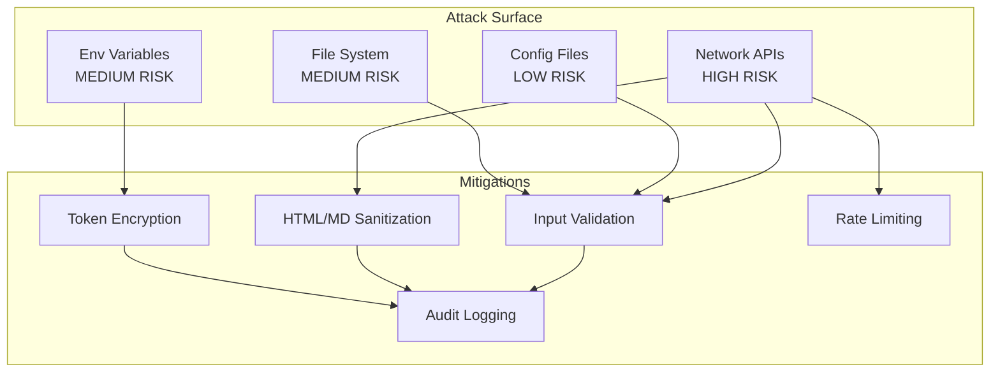
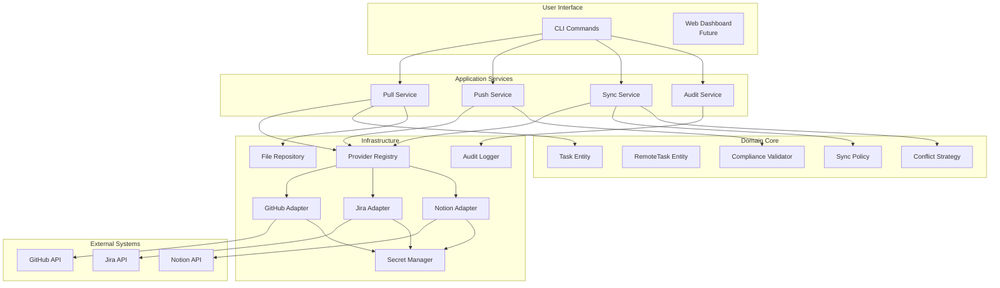
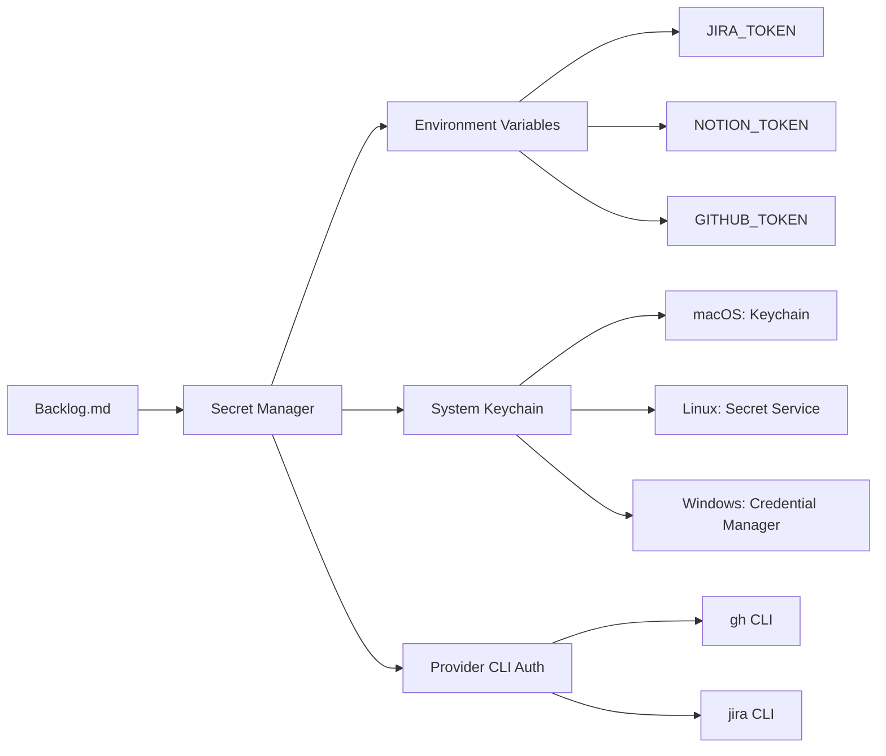
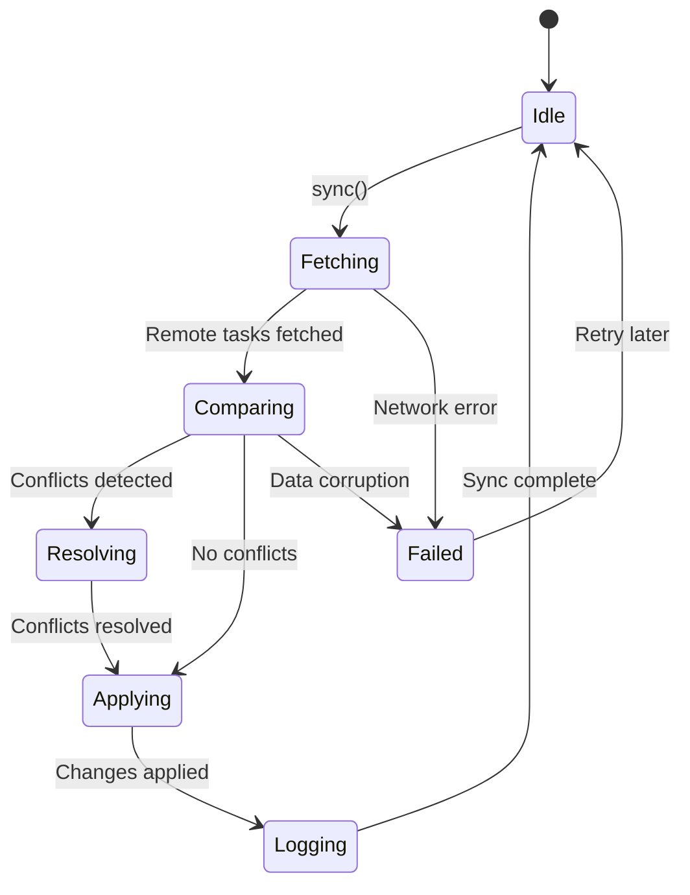
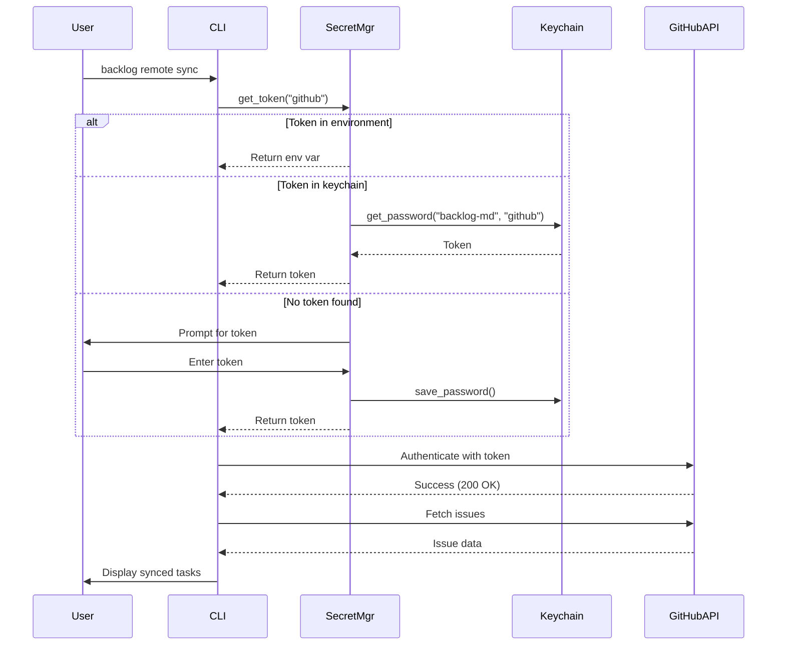
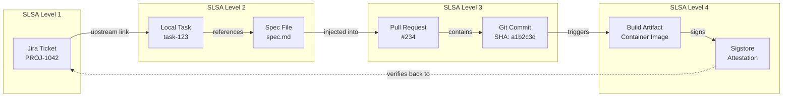

# Technical Architecture: Satellite Mode
# External Issue Tracker Integration

**Status:** Draft
**Owner:** Software Architect (Enhanced)
**Version:** 1.0
**Last Updated:** 2025-11-24

---

## Architectural Vision

Satellite Mode transforms Backlog.md into a **universal adapter layer** between developers and enterprise issue tracking systems. The architecture follows **Architect Elevator** principles:

1. **Penthouse (Strategy):** Enable enterprise compliance without sacrificing developer velocity
2. **Mezzanine (Architecture):** Clean boundaries, extensible adapter pattern, security-first design
3. **Engine Room (Implementation):** Robust APIs, error handling, performance optimization

---

## Core Architectural Principles

### 1. Separation of Concerns (Clean Architecture)

```
┌─────────────────────────────────────────────┐
│         CLI Layer (User Interface)          │
│  Commands: pull, push, sync, status         │
└─────────────────┬───────────────────────────┘
                  │
┌─────────────────▼───────────────────────────┐
│      Application Layer (Use Cases)          │
│  PullTask, SyncTasks, CreatePR, Audit       │
└─────────────────┬───────────────────────────┘
                  │
┌─────────────────▼───────────────────────────┐
│       Domain Layer (Business Logic)         │
│  Task, RemoteTask, SyncStrategy, Policy     │
└─────────────────┬───────────────────────────┘
                  │
┌─────────────────▼───────────────────────────┐
│    Infrastructure Layer (Adapters)          │
│  GitHubProvider, JiraProvider, FileSystem   │
└─────────────────────────────────────────────┘
```

**Benefits:**
- Domain logic independent of provider APIs
- Easy to test (mock adapters)
- Add new providers without changing core logic
- Swap implementations (e.g., REST → GraphQL)

---

### 2. Adapter Pattern (Pluggable Providers)

**Problem:** Each issue tracker has unique APIs, auth, data models
**Solution:** Abstract differences behind common interface

```python
# domain/remote_provider.py
class RemoteProvider(ABC):
    @abstractmethod
    async def fetch_task(self, id: str) -> RemoteTask: ...

    @abstractmethod
    async def update_status(self, id: str, status: str): ...

# infrastructure/github_provider.py
class GitHubProvider(RemoteProvider):
    async def fetch_task(self, id: str) -> RemoteTask:
        # GitHub-specific API calls
        issue = await self.client.get_issue(id)
        return RemoteTask(...)

# infrastructure/jira_provider.py
class JiraProvider(RemoteProvider):
    async def fetch_task(self, id: str) -> RemoteTask:
        # Jira-specific API calls
        issue = await self.client.issue(id)
        return RemoteTask(...)
```

**Extension Point:** New providers implement `RemoteProvider` interface only

---

### 3. Security by Design

**Principle:** Never trust external data, never expose secrets

#### Threat Model



#### Defense in Depth

1. **Input Validation:** Strict schema validation for external data
2. **Sanitization:** Remove HTML tags, escape markdown from external descriptions
3. **Token Security:** Keychain storage, never log tokens, short-lived tokens
4. **Rate Limiting:** Exponential backoff, respect provider limits
5. **Audit Logging:** Record all write operations (who, what, when, where)
6. **Principle of Least Privilege:** Minimal OAuth scopes

---

### 4. Fail-Safe Defaults & Graceful Degradation

**Principle:** Remote failures never block local operations

```python
# Graceful degradation example
async def sync_tasks():
    try:
        remote_tasks = await provider.fetch_tasks()
    except NetworkError as e:
        logger.warning(f"Remote sync failed: {e}")
        logger.info("Continuing in local-only mode")
        return []  # Empty list, don't block user
    except AuthError as e:
        logger.error(f"Auth failed: {e}. Run 'backlog remote auth github'")
        return []
```

**Design Choices:**
- Remote config disabled by default (`enabled: false`)
- Strict mode opt-in (`compliance.strict_mode: false`)
- Auto-sync disabled by default (`auto_sync: false`)
- Local changes take precedence in conflicts (`conflict_resolution: local_wins`)

---

## System Architecture

### High-Level Component Diagram



---

## Detailed Design

### 1. Provider Registry (Factory Pattern)

**Responsibility:** Manage provider lifecycle, route requests to correct provider

```python
# infrastructure/provider_registry.py

from typing import Dict, Type
from domain.remote_provider import RemoteProvider
from infrastructure.github_provider import GitHubProvider
from infrastructure.jira_provider import JiraProvider
from infrastructure.notion_provider import NotionProvider

class ProviderRegistry:
    """Central registry for all remote providers."""

    _providers: Dict[str, Type[RemoteProvider]] = {
        "github": GitHubProvider,
        "jira": JiraProvider,
        "notion": NotionProvider,
    }

    _instances: Dict[str, RemoteProvider] = {}

    @classmethod
    def get_provider(cls, name: str) -> RemoteProvider:
        """Get or create provider instance."""
        if name not in cls._instances:
            provider_class = cls._providers.get(name)
            if not provider_class:
                raise ValueError(f"Unknown provider: {name}")
            cls._instances[name] = provider_class()
        return cls._instances[name]

    @classmethod
    def detect_provider(cls, external_id: str) -> str:
        """Auto-detect provider from ID pattern."""
        patterns = {
            r"^[A-Z]+-\d+$": "jira",           # PROJ-123
            r"^#?\d+$": "github",              # #42 or 42
            r"^[\w-]+/[\w-]+#\d+$": "github",  # owner/repo#42
            r"^https://notion.so/": "notion",  # Notion URL
        }
        for pattern, provider in patterns.items():
            if re.match(pattern, external_id):
                return provider
        raise ValueError(f"Could not detect provider from ID: {external_id}")

    @classmethod
    def register_provider(cls, name: str, provider_class: Type[RemoteProvider]):
        """Register custom provider (extension point)."""
        cls._providers[name] = provider_class
```

---

### 2. Secret Management

**Requirement:** Never store secrets in config files or git

#### Architecture



#### Implementation

```python
# infrastructure/secret_manager.py

import os
import keyring
import subprocess
from typing import Optional

class SecretManager:
    """Secure credential management across platforms."""

    SERVICE_NAME = "backlog-md"

    @staticmethod
    def get_token(provider: str, method: str = "auto") -> Optional[str]:
        """
        Get authentication token for provider.

        Priority:
        1. Environment variable
        2. System keychain
        3. CLI auth (gh, jira)
        4. Interactive prompt (fallback)
        """
        env_var = f"{provider.upper()}_API_TOKEN"

        # 1. Environment variable
        if token := os.getenv(env_var):
            return token

        # 2. System keychain
        if token := keyring.get_password(SecretManager.SERVICE_NAME, provider):
            return token

        # 3. Provider CLI auth
        if method == "cli":
            if provider == "github":
                return SecretManager._get_gh_token()
            elif provider == "jira":
                return SecretManager._get_jira_token()

        # 4. Interactive prompt (only if TTY)
        if sys.stdin.isatty():
            token = input(f"Enter {provider} API token: ").strip()
            if token:
                # Offer to save to keychain
                save = input("Save to keychain? (y/n): ").strip().lower()
                if save == "y":
                    keyring.set_password(SecretManager.SERVICE_NAME, provider, token)
                return token

        return None

    @staticmethod
    def _get_gh_token() -> Optional[str]:
        """Extract token from gh CLI."""
        try:
            result = subprocess.run(
                ["gh", "auth", "token"],
                capture_output=True,
                text=True,
                check=True
            )
            return result.stdout.strip()
        except (subprocess.CalledProcessError, FileNotFoundError):
            return None

    @staticmethod
    def _get_jira_token() -> Optional[str]:
        """Extract token from jira CLI config."""
        # Implementation depends on jira CLI tool
        pass

    @staticmethod
    def delete_token(provider: str):
        """Remove token from keychain."""
        try:
            keyring.delete_password(SecretManager.SERVICE_NAME, provider)
        except keyring.errors.PasswordDeleteError:
            pass  # Already deleted
```

**Security Properties:**
- Tokens never logged (custom logger filter)
- Tokens never in config files (validation check)
- Short-lived tokens preferred (OAuth refresh)
- Encrypted at rest in keychain

---

### 3. Sync Engine

**Responsibility:** Bidirectional synchronization with conflict resolution

#### State Machine



#### Algorithm

```python
# application/sync_service.py

from typing import List, Dict
from domain.task import Task
from domain.remote_task import RemoteTask
from domain.sync_policy import SyncPolicy
from domain.conflict_strategy import ConflictStrategy

class SyncService:
    """Bidirectional synchronization service."""

    def __init__(
        self,
        provider: RemoteProvider,
        policy: SyncPolicy,
        conflict_strategy: ConflictStrategy,
    ):
        self.provider = provider
        self.policy = policy
        self.conflict_strategy = conflict_strategy

    async def sync(self) -> SyncResult:
        """
        Perform bidirectional sync.

        Algorithm:
        1. Fetch remote tasks matching filter
        2. Fetch local tasks with upstream links
        3. Detect changes (compare timestamps)
        4. Resolve conflicts
        5. Apply updates (local + remote)
        6. Log results
        """
        # 1. Fetch remote tasks
        remote_tasks = await self.provider.fetch_tasks(self.policy.remote_filter)

        # 2. Fetch local tasks
        local_tasks = self._get_local_tasks_with_upstream()

        # 3. Build sync plan
        sync_plan = self._create_sync_plan(local_tasks, remote_tasks)

        # 4. Resolve conflicts
        if sync_plan.conflicts:
            sync_plan = self.conflict_strategy.resolve(sync_plan)

        # 5. Apply changes
        results = await self._apply_sync_plan(sync_plan)

        # 6. Log audit trail
        self._log_sync_results(results)

        return results

    def _create_sync_plan(
        self,
        local: Dict[str, Task],
        remote: List[RemoteTask]
    ) -> SyncPlan:
        """
        Compare local and remote, create sync plan.

        Cases:
        - Remote exists, local doesn't → CREATE local
        - Local exists, remote doesn't → archive local (deleted remotely)
        - Both exist, remote newer → UPDATE local
        - Both exist, local newer → UPDATE remote (if enabled)
        - Both exist, conflicting changes → CONFLICT
        """
        plan = SyncPlan()

        # Build lookup map
        remote_map = {rt.external_id: rt for rt in remote}
        local_by_upstream = {
            t.upstream.id: t for t in local.values()
            if t.upstream
        }

        # Analyze each remote task
        for remote_id, remote_task in remote_map.items():
            if remote_id not in local_by_upstream:
                # New remote task
                plan.add_action("create_local", remote_task)
            else:
                local_task = local_by_upstream[remote_id]
                if self._has_conflict(local_task, remote_task):
                    plan.add_conflict(local_task, remote_task)
                elif self._remote_is_newer(local_task, remote_task):
                    plan.add_action("update_local", remote_task)
                elif self._local_is_newer(local_task, remote_task):
                    if self.policy.push_enabled:
                        plan.add_action("update_remote", local_task)

        # Analyze local tasks not in remote (deleted remotely)
        for local_id, local_task in local_by_upstream.items():
            if local_id not in remote_map:
                plan.add_action("archive_local", local_task)

        return plan

    def _has_conflict(self, local: Task, remote: RemoteTask) -> bool:
        """
        Detect conflicts: both changed since last sync.

        Conflict = local.updated > local.upstream.last_sync
                   AND remote.updated > local.upstream.last_sync
        """
        last_sync = local.upstream.last_sync
        return (local.updated > last_sync and
                remote.updated > last_sync)

    async def _apply_sync_plan(self, plan: SyncPlan) -> SyncResult:
        """Execute sync plan, apply all changes."""
        results = SyncResult()

        for action in plan.actions:
            try:
                if action.type == "create_local":
                    await self._create_local_task(action.remote_task)
                    results.add_success(action, "created")

                elif action.type == "update_local":
                    await self._update_local_task(action.remote_task)
                    results.add_success(action, "updated")

                elif action.type == "update_remote":
                    await self._update_remote_task(action.local_task)
                    results.add_success(action, "pushed")

                elif action.type == "archive_local":
                    await self._archive_local_task(action.local_task)
                    results.add_success(action, "archived")

            except Exception as e:
                results.add_failure(action, str(e))

        return results
```

---

### 4. Conflict Resolution Strategies

**Pattern:** Strategy pattern for pluggable conflict resolution

```python
# domain/conflict_strategy.py

from abc import ABC, abstractmethod
from enum import Enum

class ConflictResolution(Enum):
    LOCAL_WINS = "local_wins"
    REMOTE_WINS = "remote_wins"
    PROMPT = "prompt"
    MERGE = "merge"

class ConflictStrategy(ABC):
    @abstractmethod
    def resolve(self, conflict: Conflict) -> Resolution:
        """Resolve conflict and return chosen version."""
        pass

class LocalWinsStrategy(ConflictStrategy):
    """Always prefer local changes."""
    def resolve(self, conflict: Conflict) -> Resolution:
        return Resolution(chosen="local", task=conflict.local_task)

class RemoteWinsStrategy(ConflictStrategy):
    """Always prefer remote changes."""
    def resolve(self, conflict: Conflict) -> Resolution:
        return Resolution(chosen="remote", task=conflict.remote_task)

class PromptStrategy(ConflictStrategy):
    """Prompt user interactively."""
    def resolve(self, conflict: Conflict) -> Resolution:
        print(f"CONFLICT: {conflict.task_id}")
        print(f"Local:  {conflict.local_diff}")
        print(f"Remote: {conflict.remote_diff}")
        choice = input("Choose: [l]ocal, [r]emote, [m]erge: ")

        if choice == "l":
            return Resolution(chosen="local", task=conflict.local_task)
        elif choice == "r":
            return Resolution(chosen="remote", task=conflict.remote_task)
        elif choice == "m":
            return self._merge_conflict(conflict)

class SmartMergeStrategy(ConflictStrategy):
    """Merge non-conflicting fields."""
    def resolve(self, conflict: Conflict) -> Resolution:
        merged = Task()

        # Field-level merge logic
        for field in Task.FIELDS:
            local_val = getattr(conflict.local_task, field)
            remote_val = getattr(conflict.remote_task, field)

            if local_val == remote_val:
                setattr(merged, field, local_val)
            elif field in conflict.local_task.changed_fields:
                # Local changed, remote didn't
                setattr(merged, field, local_val)
            elif field in conflict.remote_task.changed_fields:
                # Remote changed, local didn't
                setattr(merged, field, remote_val)
            else:
                # Both changed → escalate to user
                raise ConflictError(f"Cannot auto-merge field: {field}")

        return Resolution(chosen="merged", task=merged)
```

---

### 5. Rate Limiting & Retry Logic

**Requirement:** Respect API rate limits, handle transient failures

```python
# infrastructure/rate_limiter.py

import asyncio
from datetime import datetime, timedelta
from typing import Optional

class RateLimiter:
    """Token bucket rate limiter."""

    def __init__(self, max_requests: int, time_window: timedelta):
        self.max_requests = max_requests
        self.time_window = time_window
        self.tokens = max_requests
        self.last_refill = datetime.now()

    async def acquire(self):
        """Acquire token, block if rate limit reached."""
        if self.tokens <= 0:
            wait_time = self._time_until_refill()
            if wait_time > 0:
                logger.warning(f"Rate limit reached, waiting {wait_time}s")
                await asyncio.sleep(wait_time)
                self._refill()

        self.tokens -= 1

    def _refill(self):
        """Refill token bucket."""
        now = datetime.now()
        elapsed = (now - self.last_refill).total_seconds()
        window_seconds = self.time_window.total_seconds()

        if elapsed >= window_seconds:
            self.tokens = self.max_requests
            self.last_refill = now

    def _time_until_refill(self) -> float:
        """Calculate seconds until tokens refill."""
        elapsed = (datetime.now() - self.last_refill).total_seconds()
        window_seconds = self.time_window.total_seconds()
        return max(0, window_seconds - elapsed)

# Retry with exponential backoff
from tenacity import (
    retry,
    stop_after_attempt,
    wait_exponential,
    retry_if_exception_type
)

@retry(
    stop=stop_after_attempt(3),
    wait=wait_exponential(multiplier=1, min=2, max=10),
    retry=retry_if_exception_type(NetworkError)
)
async def fetch_with_retry(url: str):
    """Fetch with automatic retry on network errors."""
    async with httpx.AsyncClient() as client:
        response = await client.get(url)
        response.raise_for_status()
        return response.json()
```

---

### 6. Data Model Persistence

**Requirement:** Extend frontmatter schema without breaking existing files

#### Migration Strategy

```python
# infrastructure/task_migration.py

from typing import Dict, Any

class TaskMigration:
    """Migrate task files to new schema version."""

    CURRENT_VERSION = 2  # Satellite Mode = v2

    @staticmethod
    def migrate(frontmatter: Dict[str, Any]) -> Dict[str, Any]:
        """Migrate task to current schema version."""
        version = frontmatter.get("schema_version", 1)

        if version < 2:
            # Add upstream field
            frontmatter["upstream"] = None
            frontmatter["compliance"] = {
                "risk_level": "low",
                "requires_approval": False
            }
            frontmatter["spec"] = None
            frontmatter["schema_version"] = 2

        return frontmatter

    @staticmethod
    def is_compatible(frontmatter: Dict[str, Any]) -> bool:
        """Check if task file is compatible."""
        version = frontmatter.get("schema_version", 1)
        return version <= TaskMigration.CURRENT_VERSION
```

#### Backward Compatibility

```python
# domain/task.py

from typing import Optional
from dataclasses import dataclass, field

@dataclass
class Upstream:
    """Upstream tracking metadata."""
    provider: str
    id: str
    url: str
    last_sync: datetime
    sync_direction: str = "bidirectional"
    fields: Dict[str, Any] = field(default_factory=dict)

@dataclass
class Task:
    """Task entity with optional upstream link."""
    id: str
    title: str
    status: str
    # ... existing fields ...

    # NEW: Optional fields (backward compatible)
    upstream: Optional[Upstream] = None
    compliance: Optional[Dict[str, Any]] = None
    spec: Optional[Dict[str, Any]] = None
    schema_version: int = 2

    @property
    def has_upstream(self) -> bool:
        """Check if task is linked to remote."""
        return self.upstream is not None

    @property
    def is_synced(self) -> bool:
        """Check if task is in sync with remote."""
        if not self.has_upstream:
            return False
        return self.updated <= self.upstream.last_sync
```

---

## Deployment Architecture

### Multi-Platform Credential Flow



---

## Compliance Architecture

### SLSA Provenance Chain



### Audit Log Schema

```json
{
  "version": "1.0",
  "timestamp": "2025-11-24T10:00:00Z",
  "event_type": "remote_push",
  "actor": {
    "user": "jdoe",
    "email": "jdoe@company.com"
  },
  "resource": {
    "type": "task",
    "id": "task-123",
    "upstream": {
      "provider": "jira",
      "id": "PROJ-1042"
    }
  },
  "action": {
    "operation": "create_pull_request",
    "target": "github",
    "pr_number": 234,
    "pr_url": "https://github.com/owner/repo/pull/234"
  },
  "compliance": {
    "risk_level": "low",
    "approved": true,
    "approver": "manager@company.com"
  },
  "metadata": {
    "spec_checksum": "sha256:abc123...",
    "git_commit": "a1b2c3d4",
    "branch": "fix/login-latency"
  }
}
```

---

## Performance Optimization

### Caching Strategy

```python
# infrastructure/cache.py

import hashlib
import json
from datetime import datetime, timedelta
from typing import Optional, Any

class ResponseCache:
    """Cache remote API responses with TTL."""

    def __init__(self, ttl: timedelta = timedelta(minutes=5)):
        self.ttl = ttl
        self.cache: Dict[str, CacheEntry] = {}

    def get(self, key: str) -> Optional[Any]:
        """Get cached value if not expired."""
        if entry := self.cache.get(key):
            if datetime.now() - entry.timestamp < self.ttl:
                return entry.value
            else:
                del self.cache[key]  # Expired, delete
        return None

    def set(self, key: str, value: Any):
        """Cache value with current timestamp."""
        self.cache[key] = CacheEntry(value, datetime.now())

    @staticmethod
    def make_key(provider: str, method: str, args: tuple) -> str:
        """Generate cache key from method call."""
        data = f"{provider}:{method}:{json.dumps(args)}"
        return hashlib.sha256(data.encode()).hexdigest()
```

### Batch Operations

```python
# Fetch tasks in batches to reduce API calls
async def fetch_tasks_batch(ids: List[str], batch_size: int = 50):
    """Fetch multiple tasks in parallel batches."""
    batches = [ids[i:i+batch_size] for i in range(0, len(ids), batch_size)]

    all_tasks = []
    for batch in batches:
        # Parallel fetch within batch
        tasks = await asyncio.gather(
            *[provider.fetch_task(id) for id in batch],
            return_exceptions=True
        )
        all_tasks.extend(tasks)

    return all_tasks
```

---

## Testing Strategy

### Test Pyramid

```
          ┌─────────────┐
          │   E2E Tests  │  (5%)
          │  Real APIs   │
          └──────┬───────┘
         ┌───────▼────────┐
         │ Integration    │  (15%)
         │ Tests (Mocks)  │
         └────────┬───────┘
        ┌─────────▼──────────┐
        │   Unit Tests       │  (80%)
        │  (Fast, Isolated)  │
        └────────────────────┘
```

### Mock Providers for Testing

```python
# tests/mocks/mock_provider.py

class MockGitHubProvider(RemoteProvider):
    """Mock provider for testing without real API calls."""

    def __init__(self):
        self.issues: Dict[str, dict] = {}
        self.call_count = 0

    async def fetch_task(self, id: str) -> RemoteTask:
        self.call_count += 1
        if issue := self.issues.get(id):
            return RemoteTask(**issue)
        raise NotFoundError(f"Issue not found: {id}")

    def add_issue(self, id: str, **kwargs):
        """Helper to populate mock data."""
        self.issues[id] = kwargs

# Usage in tests
@pytest.fixture
def mock_github():
    provider = MockGitHubProvider()
    provider.add_issue("42", title="Test Issue", status="open")
    return provider

def test_pull_task(mock_github):
    service = PullService(provider=mock_github)
    task = await service.pull("42")
    assert task.title == "Test Issue"
    assert mock_github.call_count == 1
```

---

## Monitoring & Observability

### Telemetry Points

1. **Sync metrics**: Success rate, latency, conflicts
2. **Provider health**: API availability, error rates, rate limits
3. **User behavior**: Command usage, feature adoption
4. **Performance**: Cache hit rate, batch sizes

### Structured Logging

```python
# infrastructure/logger.py

import structlog

logger = structlog.get_logger()

# Log with structured context
logger.info(
    "sync_completed",
    provider="github",
    tasks_synced=25,
    conflicts=2,
    duration_ms=1234,
    user_id="jdoe"
)

# Output (JSON format for parsing)
{
  "event": "sync_completed",
  "timestamp": "2025-11-24T10:00:00Z",
  "provider": "github",
  "tasks_synced": 25,
  "conflicts": 2,
  "duration_ms": 1234,
  "user_id": "jdoe",
  "level": "info"
}
```

---

## Extension Points

### Custom Provider Plugin

```python
# example_plugins/azure_devops_provider.py

from backlog_md.domain.remote_provider import RemoteProvider

class AzureDevOpsProvider(RemoteProvider):
    """Custom provider for Azure DevOps."""

    @property
    def name(self) -> str:
        return "azure_devops"

    async def fetch_task(self, id: str) -> RemoteTask:
        # Azure DevOps API implementation
        pass

# Register plugin
from backlog_md.infrastructure.provider_registry import ProviderRegistry

ProviderRegistry.register_provider("azure_devops", AzureDevOpsProvider)
```

---

## Migration Path

### Phase 1: GitHub Only (Weeks 1-6)
- Core adapter interface
- GitHub provider (gh CLI auth)
- Basic pull/push commands
- Security review

### Phase 2: Sync Engine (Weeks 7-10)
- Bidirectional sync
- Conflict resolution
- Rate limiting
- Audit logging

### Phase 3: Jira (Weeks 11-14)
- Jira REST API adapter
- Field mapping DSL
- Status transition mapping

### Phase 4: Notion (Weeks 15-18)
- Notion SDK adapter
- Database property mapping
- Compliance features

### Phase 5: Hardening (Weeks 19-20)
- Security audit
- Performance optimization
- Documentation
- Beta release

---

## Architectural Decision Records (ADRs)

### ADR-001: Adapter Pattern for Providers
**Decision:** Use adapter pattern with common interface
**Rationale:** Isolates provider-specific code, enables extensibility
**Alternatives:** Direct integration (rejected: tight coupling)

### ADR-002: Local-First with Graceful Degradation
**Decision:** Local operations never blocked by remote failures
**Rationale:** Developer experience > perfect sync
**Alternatives:** Online-only mode (rejected: poor UX)

### ADR-003: Keychain for Token Storage
**Decision:** Use system keychain, never config files
**Rationale:** Security best practice, meets compliance
**Alternatives:** Encrypted config file (rejected: key management problem)

### ADR-004: Async I/O for API Calls
**Decision:** Use asyncio for concurrent API requests
**Rationale:** Performance (parallel fetches), Python 3.11+ standard
**Alternatives:** Synchronous (rejected: slow for batch operations)

### ADR-005: Markdown for Audit Log
**Decision:** Human-readable audit log in addition to JSON
**Rationale:** Developer-friendly, git-diffable
**Alternatives:** Binary format (rejected: not inspectable)

---

## Security Review Checklist

- [ ] No secrets in config.yml (automated check)
- [ ] Tokens never logged (custom log filter)
- [ ] Input validation on all external data
- [ ] HTML/Markdown sanitization from remote
- [ ] Rate limiting respects provider limits
- [ ] OAuth uses minimal scopes
- [ ] HTTPS only (no HTTP fallback)
- [ ] Audit log records all write operations
- [ ] Token rotation supported
- [ ] Secrets in CI use GitHub Secrets
- [ ] Dependency scanning (Dependabot)
- [ ] SAST scanning (CodeQL)

---

## Open Architectural Questions

1. **Offline queue:** Should we queue operations when offline? (Complexity vs UX)
2. **Webhook support:** Should we support webhooks for real-time sync? (Overhead vs latency)
3. **Multi-repo:** How to handle tasks spanning multiple repos? (Scope creep risk)
4. **Custom fields:** How flexible should field mapping be? (Complexity vs flexibility)
5. **Versioning:** How to handle breaking API changes from providers? (Pinning vs auto-update)

---

## References

- **Clean Architecture:** Robert C. Martin
- **Architect Elevator:** Gregor Hohpe
- **SLSA Framework:** https://slsa.dev/
- **NIST CSF:** https://www.nist.gov/cyberframework
- **Keyring Library:** https://github.com/jaraco/keyring
- **Tenacity (Retry):** https://github.com/jd/tenacity
- **Structlog:** https://www.structlog.org/

---

**Next:** Detailed task breakdown (features/satellite-mode/tasks.md)
