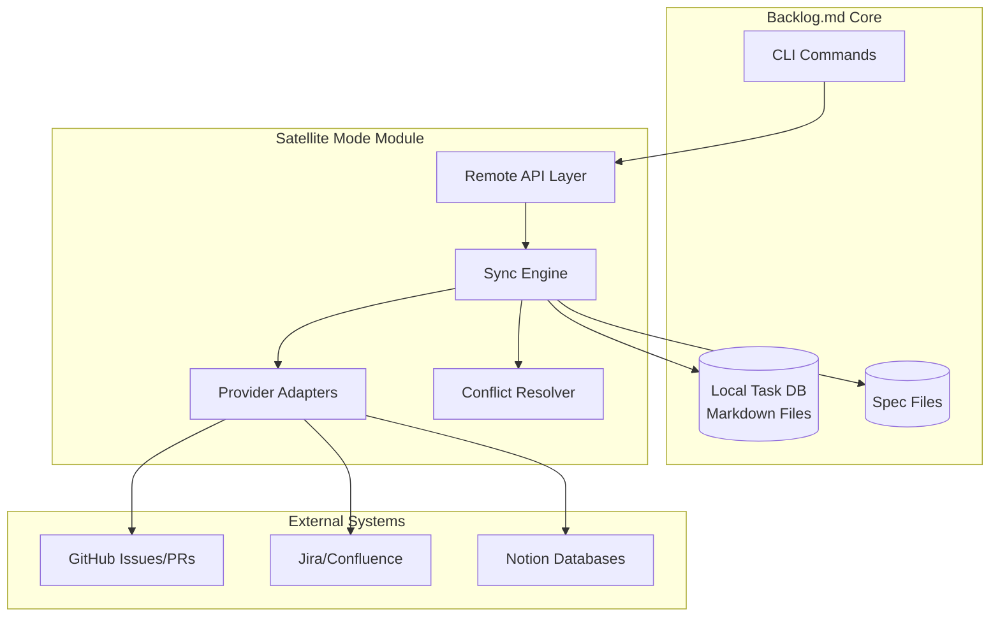
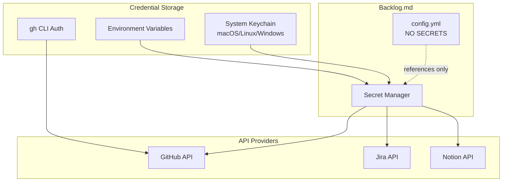

# Product Requirements Document: Satellite Mode
# External Issue Tracker Integration for Backlog.md

**Status:** Draft
**Owner:** Product Requirements Manager (Enhanced)
**Target System:** Backlog.md Core
**Priority:** High
**Version:** 1.0
**Last Updated:** 2025-11-24

---

## Executive Summary

**Satellite Mode** transforms Backlog.md from an isolated local task manager into a bidirectional synchronization layer between developers and enterprise issue tracking systems (GitHub Issues, Jira, Notion). This feature enables teams to maintain the speed and developer experience of local-first tooling while satisfying compliance, auditability, and collaboration requirements of enterprise software development.

### Key Value Proposition

- **Developer Experience**: Work locally with lightweight markdown, sync when ready
- **Compliance**: Maintain immutable audit trail from requirement → spec → implementation → PR
- **Flexibility**: Optional feature with graceful degradation; works standalone without remotes
- **Security**: Enterprise-grade credential management, never storing secrets in config files
- **Extensibility**: Adapter pattern supports any issue tracker via plugin architecture

---

## DVF+V Risk Assessment (SVPG Framework)

### Desirability Risk: MEDIUM

**What makes this desirable to users?**
- Developers want local-first tools with offline capability but need to sync with team systems
- Teams want single source of truth without sacrificing developer velocity
- Compliance officers need verifiable links between requirements and code changes

**Evidence Needed:**
- [ ] User interviews with 5+ teams currently using both Backlog.md and remote trackers
- [ ] Survey: % of users who would adopt this feature vs. those who prefer local-only
- [ ] A/B test: Adoption rate with/without this feature in beta program

**Discovery Gaps:**
1. **Pain point validation**: How painful is manual sync today? What workarounds exist?
2. **Frequency analysis**: How often do users need to sync? Real-time vs. daily vs. on-demand?
3. **Friction points**: What stops users from adopting complex sync tools today?

**Mitigation:**
- Phase 1: Ship with GitHub only (lowest barrier, uses `gh` CLI auth)
- Gather telemetry on sync frequency and failure modes
- Beta program with 10+ early adopters before general release

### Viability Risk: MEDIUM-HIGH

**Business/Market Viability:**
- **Competitive landscape**: Tools like Linear, Height, Shortcut offer similar hybrid models
- **Market size**: Developers using CLI tools + enterprise issue trackers (GitHub: 100M+, Jira: 10M+)
- **Monetization**: Open-source core, potential premium adapters (enterprise Jira, Azure DevOps)

**Organizational Viability:**
- **Support burden**: OAuth flows, API rate limits, breaking changes from providers
- **Maintenance cost**: 3 adapters × multiple API versions = high long-term cost
- **Legal/compliance**: Data residency (EU vs US), GDPR implications of caching remote data

**Evidence Needed:**
- [ ] Cost analysis: Engineering hours to build vs. maintain over 2 years
- [ ] Legal review: Data processing agreements with Atlassian/GitHub/Notion APIs
- [ ] Support capacity: Can we handle auth troubleshooting across 3 platforms?

**Mitigation:**
- Start with GitHub (most users, simplest auth via gh CLI)
- Partner with enterprise customers for Jira/Notion validation
- Build telemetry early to detect support issues proactively

### Feasibility Risk: LOW-MEDIUM

**Technical Feasibility:**
- **API availability**: All 3 platforms have robust REST/GraphQL APIs
- **Auth complexity**: OAuth2, API tokens, PATs - well-understood patterns
- **Data mapping**: Field mapping is complex but solvable with config

**Team Feasibility:**
- **Skills required**: API integration, OAuth flows, error handling, retry logic
- **Timeline**: 6-8 weeks for Phase 1 (GitHub), +4 weeks per additional adapter
- **Dependencies**: None; can be developed in parallel with other features

**Evidence Needed:**
- [ ] Spike: GitHub API integration (2 days)
- [ ] Spike: Jira API auth + field mapping (3 days)
- [ ] Security review: Token storage patterns (keychain, env vars)

**Mitigation:**
- Use proven libraries: `octokit` (GitHub), `jira-python`, `notion-sdk-py`
- Reference implementations: `gh` CLI, `jira-cli`
- Security audit before beta release

### Value Risk: LOW

**Measurable Outcomes:**
1. **Adoption**: 30%+ of Backlog.md users enable remote sync within 3 months
2. **Retention**: 80%+ of users who enable sync continue using it after 30 days
3. **Efficiency**: 50% reduction in time spent manually copying between systems
4. **Compliance**: 100% traceability for PR → Ticket mapping in strict mode

**Success Metrics:**
- **Primary**: Weekly active users of `backlog remote` commands
- **Secondary**: PR creation via `backlog remote push` vs. manual PR creation
- **Quality**: Error rate on sync operations (target: <5%)
- **Performance**: Sync latency (target: <3 seconds for single task)

**Value Evidence:**
- [ ] Time study: Current manual sync time vs. automated sync
- [ ] Interview compliance officers: Value of immutable spec-to-PR linking
- [ ] Beta NPS: Would you recommend this feature? (target: 8+/10)

---

## User Stories & Acceptance Criteria

### US-1: Pull Remote Task by ID
**As a developer, I want to pull a Jira ticket by ID so I can work on it locally.**

**Acceptance Criteria:**
- `backlog remote pull PROJ-123` creates local markdown task in `backlog/tasks/`
- Task includes: title, description, assignee, status, labels, upstream link
- Frontmatter contains `upstream` object with provider, ID, URL, last_sync
- Command detects provider automatically (Jira pattern: PROJ-123, GitHub: #42 or owner/repo#42)
- If task already exists locally, prompt to overwrite or merge
- Graceful failure if API auth missing (clear error message + docs link)

**Edge Cases:**
- Invalid ID format → show supported patterns
- Task not found (404) → clear error, suggest checking permissions
- Network timeout → retry with exponential backoff (3 attempts)
- Offline mode → queue for later sync (optional)

---

### US-2: Sync Assigned Tasks
**As a team lead, I want GitHub Issues assigned to me to appear in Backlog.md automatically.**

**Acceptance Criteria:**
- `backlog remote sync` fetches all tasks matching sync filter (assignee, status, labels)
- Default filter: `assignee:@me state:open` (configurable in config.yml)
- Creates/updates local tasks, preserving local edits (merge strategy)
- Shows summary: "Synced 5 tasks: 3 new, 2 updated"
- Incremental sync uses `last_sync` timestamp (avoids re-fetching everything)
- Conflict resolution: Local changes take precedence, log conflicts for review

**Edge Cases:**
- First sync with 100+ tasks → paginate, show progress bar
- API rate limit hit → pause, show reset time, resume automatically
- Deleted remote task → archive local task (don't delete)
- Reassigned task → update assignee, notify user

---

### US-3: Create PR with Spec Injection
**As a developer, I want my PR description to automatically include the spec.md content.**

**Acceptance Criteria:**
- `backlog remote push task-123` creates GitHub PR (or Jira transition + comment for Jira)
- PR title = task title
- PR body = formatted spec content + metadata footer
- PR links to remote issue with closing keyword (`Closes #42`)
- Branch detection: Uses current git branch, validates branch name convention
- Spec validation: Ensures spec file exists and is complete (configurable checklist)
- Post-push: Updates local task status to "In Review" and upstream task status

**Template (GitHub PR Body):**
```markdown
## Implementation Specification

[Full spec.md content here]

---

**Metadata:**
- Backlog Task: task-123
- Upstream Issue: Closes #42
- Generated by: Backlog.md Satellite Mode
- Spec Last Updated: 2025-11-24T10:00:00Z
```

**Edge Cases:**
- No spec.md found → prompt to create or skip
- Branch not pushed → auto-push or error with instructions
- PR already exists → update PR body or create new commit
- Multiple remotes configured → prompt which remote to use

---

### US-4: Compliance Mode - Mandatory Upstream Linking
**As a compliance officer, I want to verify that every PR maps back to an authorized Jira ticket.**

**Acceptance Criteria:**
- `compliance.strict_mode: true` in config.yml enforces upstream requirement
- `backlog remote push` fails if task lacks `upstream.id` field
- PR template includes compliance footer with upstream link + risk level
- Git hook (optional): Blocks commits without linked task
- Audit command: `backlog compliance audit` generates report of all PR → Ticket mappings
- Report format: CSV/JSON with columns: commit_sha, pr_number, ticket_id, risk_level, timestamp

**Compliance Footer Example:**
```markdown
---
**Compliance Metadata (SLSA Level 3)**
- Upstream Authorization: PROJ-1042
- Risk Level: Low
- Approval Status: Approved
- Traceability Chain: Ticket → Spec → PR → Commit
```

**Edge Cases:**
- Hotfix without ticket → override flag `--allow-untracked` (requires justification)
- Multiple tickets per PR → support comma-separated list
- Ticket in different project → validate cross-project permissions

---

## Technical Architecture

### High-Level Architecture



### Data Model Extensions

#### Task Frontmatter Schema

```yaml
---
id: task-123
title: Fix Login Latency
status: In Progress
assignee: [jdoe]
created_date: '2025-11-20'
labels: [backend, performance, US-1]
dependencies: [task-120]

# NEW: Upstream tracking
upstream:
  provider: jira               # github | jira | notion
  id: PROJ-1042                # External ID
  url: https://company.atlassian.net/browse/PROJ-1042
  last_sync: 2025-11-24T10:00:00Z
  sync_direction: bidirectional  # pull | push | bidirectional
  fields:                       # Provider-specific fields
    story_points: 5
    priority: High
    epic_link: PROJ-100
    sprint: Sprint 42

# NEW: Compliance metadata
compliance:
  risk_level: low               # low | medium | high | critical
  requires_approval: false
  approved_by: []
  approval_date: null
  slsa_level: 3                 # 1-4

# NEW: Spec linkage
spec:
  path: features/satellite-mode/spec.md
  last_updated: 2025-11-24T09:00:00Z
  validated: true
  checksum: sha256:abc123...
---
```

#### Configuration Schema

```yaml
# backlog/config.yml

project_name: "my-project"
# ... existing config ...

# NEW: Remote provider configuration
remotes:
  github:
    enabled: true
    mode: gh_cli                # gh_cli | oauth | pat
    repo: owner/repo            # Default repo
    base_branch: main
    sync_filter: "assignee:@me state:open label:backlog-sync"
    auto_sync: false            # Sync on startup
    sync_interval: 0            # Minutes (0 = manual only)

  jira:
    enabled: false
    auth_mode: token            # token | oauth | basic
    domain: company.atlassian.net
    project: PROJ
    email: user@company.com     # For basic auth only
    # Token from env: JIRA_API_TOKEN
    sync_filter:
      jql: "assignee = currentUser() AND status IN ('To Do', 'In Progress')"
    status_map:                 # Local status → Jira status
      "To Do": "To Do"
      "In Progress": "In Development"
      "Done": "Closed"
    field_map:                  # Map custom fields
      story_points: customfield_10016
      epic_link: customfield_10014

  notion:
    enabled: false
    auth_mode: token            # token | oauth
    database_id: abc123-def456-...
    # Token from env: NOTION_API_TOKEN
    sync_filter:
      property: "Status"
      value: "In Progress"
    property_map:               # Notion properties → Task fields
      title: "Name"
      status: "Status"
      assignee: "Assignee"

# NEW: Compliance configuration
compliance:
  strict_mode: false            # Require upstream for all PRs
  required_fields: [upstream.id, spec.path]
  risk_levels: [low, medium, high, critical]
  approval_required_for: [high, critical]
  audit_log_path: .backlog/audit.log

# NEW: Sync behavior
sync:
  conflict_resolution: local_wins  # local_wins | remote_wins | prompt
  batch_size: 50                   # Tasks per batch
  rate_limit_buffer: 0.2           # Use 80% of rate limit
  retry_attempts: 3
  retry_backoff: exponential       # exponential | linear
  offline_queue: true              # Queue ops when offline
```

### Provider Adapter Interface

```python
# src/backlog_md/remote/provider.py

from abc import ABC, abstractmethod
from typing import List, Optional, Dict, Any
from datetime import datetime
from dataclasses import dataclass

@dataclass
class RemoteTask:
    """Normalized task representation from remote provider."""
    external_id: str
    title: str
    description: str
    status: str
    assignee: Optional[str]
    labels: List[str]
    created_date: datetime
    updated_date: datetime
    url: str
    custom_fields: Dict[str, Any]

@dataclass
class SyncResult:
    """Result of a sync operation."""
    success: bool
    task_id: str
    action: str  # created | updated | skipped | failed
    message: Optional[str]
    conflicts: List[str]

class RemoteProvider(ABC):
    """Base interface for remote issue tracking providers."""

    @property
    @abstractmethod
    def name(self) -> str:
        """Provider name (github, jira, notion)."""
        pass

    @abstractmethod
    async def authenticate(self) -> bool:
        """Verify authentication and return success status."""
        pass

    @abstractmethod
    async def fetch_task(self, external_id: str) -> RemoteTask:
        """Fetch a single task by external ID."""
        pass

    @abstractmethod
    async def fetch_tasks(self, filter: Dict[str, Any]) -> List[RemoteTask]:
        """Fetch multiple tasks matching filter criteria."""
        pass

    @abstractmethod
    async def update_status(self, external_id: str, status: str) -> bool:
        """Update task status on remote system."""
        pass

    @abstractmethod
    async def create_pull_request(
        self,
        title: str,
        body: str,
        base_branch: str,
        head_branch: str,
        issue_id: Optional[str] = None
    ) -> str:
        """Create PR and return PR URL. GitHub-specific but adaptable."""
        pass

    @abstractmethod
    async def post_comment(self, external_id: str, body: str) -> bool:
        """Post a comment to the remote task."""
        pass

    @abstractmethod
    async def get_rate_limit(self) -> Dict[str, Any]:
        """Return current rate limit status."""
        pass
```

### Security Architecture



**Security Principles:**

1. **Never store secrets in config.yml**: Use env vars or system keychain
2. **Least privilege**: Request minimum OAuth scopes needed
3. **Token rotation**: Support short-lived tokens, refresh tokens
4. **Sanitization**: Clean external HTML/markdown before rendering locally
5. **Audit logging**: Log all write operations (create PR, update status)
6. **Rate limiting**: Respect provider limits, exponential backoff
7. **HTTPS only**: No plaintext API calls
8. **Secrets in CI**: Use GitHub Secrets, never hardcode

**Credential Priority (decreasing):**
1. Environment variable (e.g., `JIRA_API_TOKEN`)
2. System keychain (via `keyring` library)
3. Provider CLI auth (e.g., `gh auth status`)
4. Prompt user (interactive mode only)

---

## Compliance & Supply Chain Security

### SLSA (Supply-chain Levels for Software Artifacts)

**Level 1: Source**
- Upstream link in task frontmatter provides source of requirement

**Level 2: Build**
- Spec-to-PR pipeline creates verifiable link: Ticket → Spec → Code
- Audit log records who, what, when for each change

**Level 3: Provenance**
- PR body includes full spec (immutable record of intent)
- Compliance footer with upstream ID, risk level, approvals
- Git commit messages reference task IDs

**Level 4: Hermetic Build**
- Out of scope for this feature (build system responsibility)

**Implementation:**
- `backlog remote push` generates SLSA-compliant provenance
- Audit command exports SLSA attestation format
- Integration with Sigstore/in-toto (future)

### NIST Cybersecurity Framework

**Identify (ID.AM):**
- All software changes mapped to authorized asset (ticket) in central backlog
- Asset inventory = union of all upstream tasks

**Protect (PR.AC):**
- Strict mode enforces authorization (no rogue commits)
- Git hooks validate task linkage before commit

**Detect (DE.CM):**
- Audit log enables detection of unauthorized changes
- Regular compliance audits: `backlog compliance audit --since 30d`

**Respond (RS.AN):**
- Compliance violations logged and reported
- Automated alerts for high-risk changes without approval

**Recover (RC.RP):**
- Audit trail enables forensic investigation
- Rollback capability via git + upstream status revert

### SOC 2 / ISO 27001

**Change Management (CC8.1):**
- Spec-to-PR pipeline provides evidence of design → approval → implementation
- Audit trail satisfies "documented change process" requirement

**Access Control (CC6.1):**
- API token management ensures least privilege
- Role-based access via upstream system (Jira permissions, GitHub teams)

**Monitoring (CC7.2):**
- Audit log provides continuous monitoring of changes
- Anomaly detection: PRs without upstream link in strict mode

---

## User Experience Design

### CLI Command Reference

```bash
# Remote operations
backlog remote pull <id>           # Pull single task by ID
backlog remote pull --all          # Pull all matching sync filter
backlog remote sync                # Bidirectional sync
backlog remote push <task-id>      # Create PR/update upstream
backlog remote status              # Show sync status for all tasks

# Configuration
backlog remote setup <provider>    # Interactive setup wizard
backlog remote auth <provider>     # Test authentication
backlog remote config              # View current remote config

# Compliance
backlog compliance audit           # Generate compliance report
backlog compliance validate <task> # Validate task meets compliance rules
backlog compliance report --format csv --output audit.csv
```

### Interactive Setup Wizard

```bash
$ backlog remote setup github

 Backlog.md Remote Setup - GitHub

We'll configure GitHub integration. This requires:
 - GitHub account
 - 'gh' CLI installed OR personal access token

? How do you want to authenticate? (Use arrow keys)
 Use 'gh' CLI (recommended)
 Personal Access Token (PAT)
 OAuth (browser-based)

? Which repository should we sync with?
owner/repo [current git remote]

? What should we sync? (Select with space)
 Issues assigned to me
 Issues with label "backlog"
 Pull requests assigned to me

? Enable auto-sync on startup? (y/N) n

Configuration saved to backlog/config.yml
Next: Run 'backlog remote sync' to fetch tasks

```

### Error Handling UX

**Principles:**
1. **Clear error messages**: Explain what went wrong and how to fix it
2. **Actionable suggestions**: Provide next steps, not just error codes
3. **Graceful degradation**: Never block local operations due to remote failures
4. **Retry guidance**: Show retry options for transient failures

**Examples:**

```bash
# Authentication failure
 ERROR: GitHub authentication failed

Cause: 'gh' CLI is not authenticated
Fix: Run 'gh auth login' or set GITHUB_TOKEN environment variable

Docs: https://backlog.md/docs/remote-setup#github

# Rate limit
 WARNING: GitHub rate limit reached (5000/5000 requests used)

Sync paused. Rate limit resets at 2025-11-24 15:00:00 (in 45 minutes)
Auto-resume enabled. Or run 'backlog remote sync' after reset.

# Conflict during sync
 CONFLICT: Task task-123 has local changes AND remote updates

Local:  Status: In Progress → Done (edited 2 hours ago)
Remote: Status: In Progress → Blocked (updated 1 hour ago)

? How do you want to resolve this? (Use arrow keys)
 Keep local changes (ignore remote)
 Use remote changes (overwrite local)
 Merge manually (open editor)
 Skip for now

```

---

## Implementation Phases

### Phase 1: Foundation & GitHub (6 weeks)

**Goals:**
- Core adapter interface
- GitHub provider (gh CLI auth)
- Basic pull/push commands
- Upstream field in task schema

**Deliverables:**
1. `RemoteProvider` interface
2. `GitHubProvider` implementation
3. `backlog remote pull` command
4. `backlog remote push` command (PR creation)
5. Task schema migration tool
6. Unit + integration tests
7. Security review (token handling)

**Success Criteria:**
- Can pull GitHub issue by ID
- Can create PR with spec injection
- Zero secrets in config files
- 90%+ test coverage on remote module

---

### Phase 2: Sync Engine & Conflict Resolution (4 weeks)

**Goals:**
- Bidirectional sync
- Incremental sync (last_sync timestamps)
- Conflict resolution strategies
- Rate limiting + retry logic

**Deliverables:**
1. `SyncEngine` class
2. `ConflictResolver` strategies
3. `backlog remote sync` command
4. Rate limit handling
5. Offline queue (future enhancement)
6. Sync status UI

**Success Criteria:**
- Sync 100+ tasks in <10 seconds
- Detect and resolve conflicts correctly
- Handle rate limits gracefully
- Audit log records all sync operations

---

### Phase 3: Jira & Notion Adapters (4 weeks each)

**Goals:**
- Jira provider (REST API + OAuth)
- Notion provider (SDK + database API)
- Custom field mapping
- Status mapping configuration

**Deliverables:**
1. `JiraProvider` implementation
2. `NotionProvider` implementation
3. Field mapping DSL in config.yml
4. Status transition mapping
5. Provider-specific docs
6. Migration guides

**Success Criteria:**
- Feature parity with GitHub provider
- Custom field mapping works for 3+ common fields
- Status mapping handles 80% of common Jira workflows
- Documentation covers setup for enterprise Jira

---

### Phase 4: Compliance & Audit (3 weeks)

**Goals:**
- Strict mode enforcement
- Compliance report generation
- Git hooks for validation
- SLSA provenance

**Deliverables:**
1. `backlog compliance audit` command
2. Strict mode validation
3. Pre-commit hook (optional install)
4. SLSA attestation format
5. Compliance dashboard (web UI)
6. SOC 2 evidence package

**Success Criteria:**
- Audit report covers 100% of PRs
- Strict mode blocks unlinked commits
- Compliance dashboard shows risk heatmap
- Documentation for auditors

---

## Non-Functional Requirements

### Performance
- **Sync latency**: <3s for single task, <10s for 100 tasks
- **Startup time**: <500ms overhead when remotes enabled
- **Memory**: <50MB additional for remote module
- **Disk**: <10MB for cached remote metadata

### Reliability
- **Availability**: Graceful degradation when remote unavailable (work offline)
- **Error recovery**: Auto-retry with exponential backoff (3 attempts)
- **Data integrity**: Checksums for spec files, detect tampering
- **Audit trail**: 100% coverage of write operations

### Security
- **Authentication**: Support OAuth, PAT, CLI auth
- **Authorization**: Respect upstream permissions
- **Confidentiality**: Never log tokens/secrets
- **Integrity**: Validate API responses, detect MitM

### Usability
- **Setup time**: <5 minutes for GitHub (using gh CLI)
- **Learning curve**: Intuitive commands matching git workflow
- **Error messages**: Actionable, not cryptic
- **Documentation**: Setup guides for each provider

### Maintainability
- **Code coverage**: >85% for remote module
- **API versioning**: Support multiple API versions
- **Logging**: Structured logs with trace IDs
- **Monitoring**: Telemetry for sync failures, latency

---

## Success Metrics (OKRs)

### Objective 1: Drive Adoption
**Key Results:**
- 30% of Backlog.md users enable remote sync within Q1
- 80% retention rate after 30 days
- NPS 8+ from beta users

### Objective 2: Improve Efficiency
**Key Results:**
- 50% reduction in time spent manually copying tasks
- 90% of PRs created via `backlog remote push` (vs manual)
- <5% error rate on sync operations

### Objective 3: Enable Compliance
**Key Results:**
- 100% traceability for PRs in strict mode
- Zero compliance violations in beta deployments
- 3+ enterprise customers adopt for SOC 2 evidence

---

## Open Questions & Risks

### Product Questions
1. **Sync frequency**: How often should auto-sync run? (Telemetry needed)
2. **Conflict UX**: Should we auto-resolve conflicts or always prompt?
3. **Offline mode**: Should we queue operations or fail fast?
4. **Multi-repo**: How to handle tasks spanning multiple repos?

### Technical Risks
1. **API changes**: Providers may break APIs without notice (mitigation: version pinning)
2. **Rate limits**: Aggressive sync may hit limits (mitigation: intelligent caching)
3. **Large backlogs**: Syncing 1000+ tasks may be slow (mitigation: pagination + progress UI)
4. **Custom fields**: Jira/Notion have infinite custom field combinations (mitigation: config DSL)

### Business Risks
1. **Support load**: Auth troubleshooting across 3 platforms (mitigation: self-service docs)
2. **Legal**: Data processing agreements with API providers (mitigation: legal review)
3. **Competitive**: Providers may launch competing local-first tools (mitigation: differentiate on spec-driven workflow)

---

## Appendix A: Competitive Analysis

| Feature | Backlog.md Satellite | Linear | Height | Jira CLI |
|---------|---------------------|--------|--------|----------|
| Local-first | ✅ Markdown files | ❌ Cloud-only | ❌ Cloud-only | ❌ Cloud sync |
| Offline mode | ✅ Full offline | ❌ View-only | ❌ View-only | ❌ Online only |
| Spec injection | ✅ Auto PR body | ❌ Manual | ❌ Manual | ❌ N/A |
| Compliance | ✅ SLSA ready | ⚠️ Enterprise | ⚠️ Enterprise | ✅ Native |
| Multi-provider | ✅ 3+ adapters | ❌ Linear only | ❌ Height only | ❌ Jira only |
| Open source | ✅ MIT | ❌ Proprietary | ❌ Proprietary | ❌ Proprietary |

**Differentiation:** Only Backlog.md offers true local-first with multi-provider sync AND spec-driven compliance.

---

## Appendix B: Example Workflows

### Workflow 1: Pull Jira Ticket, Work Locally, Push PR

```bash
# Morning: Pull assigned ticket
$ backlog remote pull PROJ-1042
 Created task-156: Fix Login Latency
 Spec template: features/login-latency/spec.md

# Write spec, implement fix, test locally
$ vim features/login-latency/spec.md
$ git checkout -b fix/login-latency
$ # ... code changes ...
$ git commit -m "fix: reduce login latency by 40% (task-156)"

# Push branch + create PR with spec
$ git push origin fix/login-latency
$ backlog remote push task-156
 Created PR #234: Fix Login Latency
 PR body includes full spec from features/login-latency/spec.md
 Updated Jira PROJ-1042 → "In Review"
 PR URL: https://github.com/owner/repo/pull/234
```

### Workflow 2: Compliance Audit

```bash
# Generate monthly audit report
$ backlog compliance audit --since 2025-11-01 --format csv --output november-audit.csv
 Analyzed 47 commits, 23 PRs, 18 Jira tickets
 Compliance Score: 98% (1 violation found)

 Violations:
 - PR #230: Missing upstream link (hotfix)

 Report saved: november-audit.csv

# Review violations
$ cat november-audit.csv
commit_sha,pr_number,ticket_id,risk_level,compliant,violation_reason
a1b2c3d,230,,low,false,Missing upstream link
e4f5g6h,231,PROJ-1042,low,true,
```

---

## Approval & Sign-off

- [ ] Product Manager: Approved
- [ ] Engineering Lead: Feasibility confirmed
- [ ] Security: Security review passed
- [ ] Legal: Data processing agreements reviewed
- [ ] Compliance: Audit requirements validated

**Next Steps:**
1. Technical architecture review (Software Architect)
2. Detailed task breakdown (Project Manager)
3. Phase 1 kickoff (Engineering)
