# Satellite Mode - Task Breakdown
# Implementation Plan with Dependencies

**Feature:** External Issue Tracker Integration
**Status:** Planning
**Total Tasks:** 42
**Estimated Duration:** 20 weeks
**Start Date:** TBD

---

## Task Summary by Phase

| Phase | Tasks | Duration | Dependencies |
|-------|-------|----------|--------------|
| Discovery | 5 | 2 weeks | None |
| Design | 6 | 2 weeks | Discovery complete |
| Implementation - Core | 8 | 6 weeks | Design complete |
| Implementation - Providers | 9 | 6 weeks | Core complete |
| Implementation - CLI | 5 | 2 weeks | Providers complete |
| Testing | 5 | 2 weeks | Implementation 80% |
| Documentation | 4 | 2 weeks | Parallel with testing |

**Critical Path:** Discovery → Design → Core → GitHub Provider → CLI → Testing

---

## Phase 1: Discovery (Weeks 1-2)

### task-012: Product Discovery - User Interviews
**Labels:** [discovery, US-all, P0]
**Status:** To Do
**Assignee:** PM, Researcher
**Dependencies:** None
**Parallelizable:** No

**Description:**
Conduct user interviews to validate desirability risk and pain points.

**Acceptance Criteria:**
- Interview 5+ teams using Backlog.md + remote trackers
- Survey 20+ users on adoption likelihood
- Document pain points with current manual sync
- Quantify time spent on manual sync (baseline metric)
- Create personas for primary user types

**Deliverables:**
- `discovery/user-interviews.md` - Interview notes
- `discovery/survey-results.csv` - Survey data
- `discovery/personas.md` - User personas

---

### task-013: Technical Feasibility - API Spike (GitHub)
**Labels:** [discovery, technical, spike, US-1, P0]
**Status:** To Do
**Assignee:** Backend Engineer
**Dependencies:** None
**Parallelizable:** [P] with task-014, task-015

**Description:**
Spike GitHub API integration to validate feasibility and auth patterns.

**Acceptance Criteria:**
- Authenticate using `gh` CLI token
- Fetch issue by number
- List issues with filter (assignee, status)
- Create PR with custom body
- Measure API latency (<1s per operation)
- Document rate limits (5000 req/hour)

**Deliverables:**
- `spikes/github-api-spike.py` - Proof of concept
- `spikes/github-api-spike.md` - Findings document

**Time Box:** 2 days

---

### task-014: Technical Feasibility - API Spike (Jira)
**Labels:** [discovery, technical, spike, US-1, P1]
**Status:** To Do
**Assignee:** Backend Engineer
**Dependencies:** None
**Parallelizable:** [P] with task-013, task-015

**Description:**
Spike Jira REST API integration and field mapping complexity.

**Acceptance Criteria:**
- Authenticate using API token
- Fetch issue by ID
- Map custom fields (story points, epic link)
- Test status transitions
- Document field mapping requirements

**Deliverables:**
- `spikes/jira-api-spike.py` - Proof of concept
- `spikes/jira-api-spike.md` - Findings document
- `spikes/jira-field-mapping.yml` - Sample field map

**Time Box:** 3 days

---

### task-015: Technical Feasibility - API Spike (Notion)
**Labels:** [discovery, technical, spike, US-1, P2]
**Status:** To Do
**Assignee:** Backend Engineer
**Dependencies:** None
**Parallelizable:** [P] with task-013, task-014

**Description:**
Spike Notion SDK integration and database property mapping.

**Acceptance Criteria:**
- Authenticate using integration token
- Query database with filters
- Map properties to task fields
- Create/update database items
- Document limitations (rate limits, batch size)

**Deliverables:**
- `spikes/notion-api-spike.py` - Proof of concept
- `spikes/notion-api-spike.md` - Findings document

**Time Box:** 2 days

---

### task-016: Security Architecture Review
**Labels:** [discovery, security, compliance, P0]
**Status:** To Do
**Assignee:** Security Engineer, Architect
**Dependencies:** task-013, task-014, task-015
**Parallelizable:** No

**Description:**
Review security architecture for token storage, sanitization, and compliance.

**Acceptance Criteria:**
- Threat model documented
- Token storage strategy approved (keychain)
- Sanitization requirements defined
- Compliance requirements validated (SLSA, NIST)
- Security checklist created

**Deliverables:**
- `security/threat-model.md` - Threat analysis
- `security/security-checklist.md` - Review checklist
- `security/compliance-mapping.md` - Framework mapping

---

## Phase 2: Design (Weeks 3-4)

### task-017: Design Core Adapter Interface
**Labels:** [design, architecture, P0]
**Status:** To Do
**Assignee:** Architect
**Dependencies:** task-016
**Parallelizable:** No

**Description:**
Design `RemoteProvider` interface and domain entities.

**Acceptance Criteria:**
- Interface supports all user stories (US-1 to US-4)
- `RemoteTask` entity defined
- `SyncResult` entity defined
- Error handling patterns defined
- Extension points documented

**Deliverables:**
- `src/backlog_md/domain/remote_provider.py` - Interface definition
- `src/backlog_md/domain/entities.py` - Domain entities
- `docs/architecture/adapter-interface.md` - Interface docs

---

### task-018: Design Provider Registry
**Labels:** [design, architecture, P0]
**Status:** To Do
**Assignee:** Architect
**Dependencies:** task-017
**Parallelizable:** [P] with task-019

**Description:**
Design factory pattern for provider management and auto-detection.

**Acceptance Criteria:**
- Provider registration mechanism
- Auto-detection from ID pattern
- Lazy initialization
- Extension point for custom providers

**Deliverables:**
- `src/backlog_md/infrastructure/provider_registry.py` - Registry class
- `docs/architecture/provider-registry.md` - Design doc

---

### task-019: Design Secret Management
**Labels:** [design, security, P0]
**Status:** To Do
**Assignee:** Architect, Security Engineer
**Dependencies:** task-017
**Parallelizable:** [P] with task-018

**Description:**
Design secure credential storage using system keychain and env vars.

**Acceptance Criteria:**
- Multi-platform keychain support (macOS, Linux, Windows)
- Environment variable fallback
- CLI auth integration (gh, jira)
- Interactive prompt for missing tokens
- Never store secrets in config files

**Deliverables:**
- `src/backlog_md/infrastructure/secret_manager.py` - Secret manager class
- `docs/architecture/secret-management.md` - Design doc

---

### task-020: Design Sync Engine
**Labels:** [design, architecture, US-2, P0]
**Status:** To Do
**Assignee:** Architect
**Dependencies:** task-017
**Parallelizable:** [P] with task-021

**Description:**
Design bidirectional sync algorithm with conflict detection.

**Acceptance Criteria:**
- Sync algorithm handles create/update/delete
- Incremental sync using timestamps
- Conflict detection logic
- State machine documented
- Performance targets defined (<10s for 100 tasks)

**Deliverables:**
- `src/backlog_md/application/sync_service.py` - Service skeleton
- `docs/architecture/sync-algorithm.md` - Algorithm doc

---

### task-021: Design Conflict Resolution Strategies
**Labels:** [design, architecture, US-2, P1]
**Status:** To Do
**Assignee:** Architect
**Dependencies:** task-020
**Parallelizable:** [P] with task-020

**Description:**
Design strategy pattern for pluggable conflict resolution.

**Acceptance Criteria:**
- LocalWinsStrategy
- RemoteWinsStrategy
- PromptStrategy
- SmartMergeStrategy
- Configuration options in config.yml

**Deliverables:**
- `src/backlog_md/domain/conflict_strategy.py` - Strategy interface
- `docs/architecture/conflict-resolution.md` - Design doc

---

### task-022: Design Data Model Extensions
**Labels:** [design, data-model, P0]
**Status:** To Do
**Assignee:** Architect, Backend Engineer
**Dependencies:** task-017
**Parallelizable:** No

**Description:**
Extend task frontmatter schema with upstream, compliance, spec fields.

**Acceptance Criteria:**
- Backward-compatible schema (optional fields)
- Migration strategy for existing tasks
- Validation rules
- Schema version 2 defined

**Deliverables:**
- `docs/schema/task-frontmatter-v2.yml` - Schema definition
- `src/backlog_md/infrastructure/task_migration.py` - Migration logic
- `docs/migration-guide.md` - User guide

---

## Phase 3: Implementation - Core (Weeks 5-10)

### task-023: Implement RemoteProvider Interface
**Labels:** [implementation, core, P0]
**Status:** To Do
**Assignee:** Backend Engineer
**Dependencies:** task-017
**Parallelizable:** No

**Description:**
Implement base `RemoteProvider` abstract class and domain entities.

**Acceptance Criteria:**
- `RemoteProvider` ABC with all methods
- `RemoteTask` dataclass
- `SyncResult` dataclass
- Type hints complete
- Docstrings for all public APIs

**Deliverables:**
- `src/backlog_md/domain/remote_provider.py` - Implementation
- `src/backlog_md/domain/entities.py` - Entities
- Unit tests (>90% coverage)

---

### task-024: Implement Provider Registry
**Labels:** [implementation, core, P0]
**Status:** To Do
**Assignee:** Backend Engineer
**Dependencies:** task-023
**Parallelizable:** [P] with task-025

**Description:**
Implement factory pattern for provider management.

**Acceptance Criteria:**
- `ProviderRegistry` class with registration
- Auto-detection using regex patterns
- Lazy initialization
- Thread-safe singleton pattern
- Extension API documented

**Deliverables:**
- `src/backlog_md/infrastructure/provider_registry.py` - Implementation
- Unit tests with mock providers
- `docs/extending-providers.md` - Extension guide

---

### task-025: Implement Secret Manager
**Labels:** [implementation, security, P0]
**Status:** To Do
**Assignee:** Backend Engineer
**Dependencies:** task-023
**Parallelizable:** [P] with task-024

**Description:**
Implement secure credential management with keychain support.

**Acceptance Criteria:**
- Multi-platform keychain integration (keyring library)
- Environment variable support
- `gh` CLI auth integration
- Interactive prompt with save option
- Log filter to prevent token leakage
- Token validation

**Deliverables:**
- `src/backlog_md/infrastructure/secret_manager.py` - Implementation
- Unit tests (mock keychain)
- Integration tests (real keychain on CI)

---

### task-026: Implement Sync Engine Core
**Labels:** [implementation, core, US-2, P0]
**Status:** To Do
**Assignee:** Backend Engineer
**Dependencies:** task-024, task-025
**Parallelizable:** No

**Description:**
Implement bidirectional sync algorithm.

**Acceptance Criteria:**
- `SyncService` class with sync() method
- Create/update/delete detection
- Incremental sync using last_sync timestamp
- Conflict detection
- Audit logging
- Performance target: <10s for 100 tasks

**Deliverables:**
- `src/backlog_md/application/sync_service.py` - Implementation
- Unit tests with mock provider
- Integration tests
- Performance benchmarks

---

### task-027: Implement Conflict Resolution Strategies
**Labels:** [implementation, core, US-2, P1]
**Status:** To Do
**Assignee:** Backend Engineer
**Dependencies:** task-026
**Parallelizable:** [P] with task-028

**Description:**
Implement strategy pattern for conflict resolution.

**Acceptance Criteria:**
- All 4 strategies implemented
- Configuration-driven strategy selection
- Interactive prompt UI
- Field-level merge logic
- Conflict logging

**Deliverables:**
- `src/backlog_md/domain/conflict_strategy.py` - Implementations
- Unit tests for each strategy
- `docs/user-guide/conflict-resolution.md` - User guide

---

### task-028: Implement Rate Limiter & Retry Logic
**Labels:** [implementation, core, P0]
**Status:** To Do
**Assignee:** Backend Engineer
**Dependencies:** task-026
**Parallelizable:** [P] with task-027

**Description:**
Implement token bucket rate limiter and exponential backoff retry.

**Acceptance Criteria:**
- `RateLimiter` class with token bucket algorithm
- Exponential backoff using `tenacity` library
- Configurable limits per provider
- Rate limit warnings logged
- Auto-resume after rate limit reset

**Deliverables:**
- `src/backlog_md/infrastructure/rate_limiter.py` - Implementation
- Unit tests with time mocking
- Integration tests with real APIs (controlled)

---

### task-029: Implement Task Schema Migration
**Labels:** [implementation, core, data-model, P0]
**Status:** To Do
**Assignee:** Backend Engineer
**Dependencies:** task-022
**Parallelizable:** [P] with task-030

**Description:**
Implement task file migration from schema v1 to v2.

**Acceptance Criteria:**
- `TaskMigration` class with migrate() method
- Backward compatibility check
- Atomic file updates (backup + write + verify)
- Bulk migration CLI command
- Dry-run mode

**Deliverables:**
- `src/backlog_md/infrastructure/task_migration.py` - Implementation
- Unit tests with sample task files
- `backlog migrate` CLI command

---

### task-030: Implement Audit Logger
**Labels:** [implementation, core, compliance, P0]
**Status:** To Do
**Assignee:** Backend Engineer
**Dependencies:** task-023
**Parallelizable:** [P] with task-029

**Description:**
Implement structured audit logging for compliance.

**Acceptance Criteria:**
- Structured logging with `structlog`
- JSON format for parsing
- Human-readable markdown format
- Log rotation (max 100MB)
- Audit log query API
- SLSA attestation format

**Deliverables:**
- `src/backlog_md/infrastructure/audit_logger.py` - Implementation
- Unit tests
- `docs/compliance/audit-log-format.md` - Schema doc

---

## Phase 4: Implementation - Providers (Weeks 11-16)

### task-031: Implement GitHub Provider Core
**Labels:** [implementation, provider, github, US-1, US-3, P0]
**Status:** To Do
**Assignee:** Backend Engineer
**Dependencies:** task-024, task-025
**Parallelizable:** No

**Description:**
Implement `GitHubProvider` class with basic operations.

**Acceptance Criteria:**
- Implement all `RemoteProvider` methods
- Use `PyGithub` library
- `gh` CLI auth integration
- PAT fallback
- GraphQL for efficient queries
- Rate limit handling

**Deliverables:**
- `src/backlog_md/infrastructure/github_provider.py` - Implementation
- Unit tests with mock API
- Integration tests with real API (GitHub Actions)

---

### task-032: Implement GitHub PR Creation with Spec Injection
**Labels:** [implementation, provider, github, US-3, P0]
**Status:** To Do
**Assignee:** Backend Engineer
**Dependencies:** task-031
**Parallelizable:** [P] with task-033

**Description:**
Implement PR creation with spec.md content injection.

**Acceptance Criteria:**
- Read spec file from task metadata
- Format PR body with template
- Include compliance footer
- Closing keyword for linked issue
- Branch detection and validation
- PR URL returned

**Deliverables:**
- Enhanced `create_pull_request()` method
- PR body template
- Unit tests
- Integration test (creates real PR in test repo)

---

### task-033: Implement GitHub Issue Field Mapping
**Labels:** [implementation, provider, github, US-1, US-2, P1]
**Status:** To Do
**Assignee:** Backend Engineer
**Dependencies:** task-031
**Parallelizable:** [P] with task-032

**Description:**
Map GitHub issue fields to task schema.

**Acceptance Criteria:**
- Title, body, state, assignee, labels
- Milestone mapping
- Project (beta) support
- Custom field handling (if available)
- Bidirectional mapping (task → issue)

**Deliverables:**
- Field mapping logic in provider
- Configuration schema in config.yml
- Unit tests for all field types

---

### task-034: Implement Jira Provider Core
**Labels:** [implementation, provider, jira, US-1, US-4, P0]
**Status:** To Do
**Assignee:** Backend Engineer
**Dependencies:** task-024, task-025
**Parallelizable:** No

**Description:**
Implement `JiraProvider` class with basic operations.

**Acceptance Criteria:**
- Implement all `RemoteProvider` methods
- Use `jira-python` library
- API token auth
- OAuth support (future enhancement)
- JQL query support
- Pagination handling

**Deliverables:**
- `src/backlog_md/infrastructure/jira_provider.py` - Implementation
- Unit tests with mock API
- Integration tests with Jira test instance

---

### task-035: Implement Jira Field Mapping DSL
**Labels:** [implementation, provider, jira, US-1, P0]
**Status:** To Do
**Assignee:** Backend Engineer
**Dependencies:** task-034
**Parallelizable:** [P] with task-036

**Description:**
Implement configurable field mapping for Jira custom fields.

**Acceptance Criteria:**
- Map standard fields (summary, description, status, assignee)
- Map custom fields by customfield_* IDs
- Support story points, epic link, sprint
- Field type validation
- Error handling for missing fields

**Deliverables:**
- Field mapping engine in provider
- Configuration schema in config.yml
- Sample configs for common Jira setups
- Unit tests for mapping logic

---

### task-036: Implement Jira Status Transition Mapping
**Labels:** [implementation, provider, jira, US-2, US-4, P0]
**Status:** To Do
**Assignee:** Backend Engineer
**Dependencies:** task-034
**Parallelizable:** [P] with task-035

**Description:**
Map local task status to Jira workflow transitions.

**Acceptance Criteria:**
- Configurable status mapping (local → Jira)
- Workflow-aware transitions (validate allowed)
- Handle custom workflows
- Resolution field handling
- Comment on transition (optional)

**Deliverables:**
- Status mapping logic in provider
- Configuration schema
- Sample configs for common workflows
- Unit tests

---

### task-037: Implement Notion Provider Core
**Labels:** [implementation, provider, notion, US-1, P1]
**Status:** To Do
**Assignee:** Backend Engineer
**Dependencies:** task-024, task-025
**Parallelizable:** No

**Description:**
Implement `NotionProvider` class with database operations.

**Acceptance Criteria:**
- Implement all `RemoteProvider` methods
- Use `notion-sdk-py` library
- Integration token auth
- Query database with filters
- Create/update pages
- Rate limit handling (3 req/sec)

**Deliverables:**
- `src/backlog_md/infrastructure/notion_provider.py` - Implementation
- Unit tests with mock API
- Integration tests with Notion test workspace

---

### task-038: Implement Notion Property Mapping
**Labels:** [implementation, provider, notion, US-1, P1]
**Status:** To Do
**Assignee:** Backend Engineer
**Dependencies:** task-037
**Parallelizable:** [P] with task-039

**Description:**
Map Notion database properties to task schema.

**Acceptance Criteria:**
- Support all property types (title, select, multi-select, date, person, etc.)
- Handle rich text blocks
- Relation property support
- Rollup property support (read-only)
- Bidirectional mapping

**Deliverables:**
- Property mapping logic in provider
- Configuration schema
- Sample config for task tracking database
- Unit tests

---

### task-039: Implement Cross-Provider Testing
**Labels:** [implementation, testing, P1]
**Status:** To Do
**Assignee:** Backend Engineer, QA Engineer
**Dependencies:** task-031, task-034, task-037
**Parallelizable:** No

**Description:**
Ensure all providers have feature parity and consistent behavior.

**Acceptance Criteria:**
- Shared test suite for all providers
- Contract tests (same inputs → same outputs)
- Error handling consistency
- Performance benchmarks (all providers <3s per task)
- Edge case coverage (empty fields, special chars, etc.)

**Deliverables:**
- `tests/providers/test_provider_contract.py` - Contract tests
- Performance benchmark results
- Edge case test suite

---

## Phase 5: Implementation - CLI (Weeks 17-18)

### task-040: Implement CLI Commands - Pull
**Labels:** [implementation, cli, US-1, P0]
**Status:** To Do
**Assignee:** Frontend Engineer (CLI)
**Dependencies:** task-031, task-034, task-037
**Parallelizable:** [P] with task-041

**Description:**
Implement `backlog remote pull <id>` command.

**Acceptance Criteria:**
- Auto-detect provider from ID format
- Create local task file
- Progress indicator for slow operations
- Success/error messages
- Dry-run mode (--dry-run)
- Overwrite prompt if task exists

**Deliverables:**
- `src/backlog_md/cli/remote_commands.py` - Pull command
- Integration tests
- User documentation

---

### task-041: Implement CLI Commands - Sync
**Labels:** [implementation, cli, US-2, P0]
**Status:** To Do
**Assignee:** Frontend Engineer (CLI)
**Dependencies:** task-026, task-027
**Parallelizable:** [P] with task-040

**Description:**
Implement `backlog remote sync` command.

**Acceptance Criteria:**
- Bidirectional sync with conflict UI
- Progress bar for batch operations
- Summary report (X created, Y updated, Z conflicts)
- Incremental sync (skip unchanged)
- Provider selection (--provider github)
- Dry-run mode

**Deliverables:**
- Sync command implementation
- Interactive conflict resolution UI
- Integration tests
- User documentation

---

### task-042: Implement CLI Commands - Push
**Labels:** [implementation, cli, US-3, P0]
**Status:** To Do
**Assignee:** Frontend Engineer (CLI)
**Dependencies:** task-032
**Parallelizable:** [P] with task-043

**Description:**
Implement `backlog remote push <task-id>` command.

**Acceptance Criteria:**
- Validate task has upstream link
- Find and read spec file
- Create PR (GitHub) or update status + comment (Jira/Notion)
- Compliance validation in strict mode
- Confirmation prompt before push
- Return PR/ticket URL

**Deliverables:**
- Push command implementation
- Spec validation logic
- Integration tests
- User documentation

---

### task-043: Implement CLI Commands - Status & Auth
**Labels:** [implementation, cli, P1]
**Status:** To Do
**Assignee:** Frontend Engineer (CLI)
**Dependencies:** task-024, task-025
**Parallelizable:** [P] with task-042

**Description:**
Implement `backlog remote status` and `backlog remote auth` commands.

**Acceptance Criteria:**
- Status: Show sync state for all tasks (synced, outdated, conflict)
- Status: Show provider health (authenticated, rate limit)
- Auth: Test authentication for provider
- Auth: Interactive re-auth flow
- Colorized output for readability

**Deliverables:**
- Status command implementation
- Auth command implementation
- Integration tests
- User documentation

---

### task-044: Implement CLI Setup Wizard
**Labels:** [implementation, cli, ux, P1]
**Status:** To Do
**Assignee:** Frontend Engineer (CLI)
**Dependencies:** task-025
**Parallelizable:** [P] with task-045

**Description:**
Implement `backlog remote setup <provider>` interactive wizard.

**Acceptance Criteria:**
- Step-by-step setup for each provider
- Auto-detect auth methods (gh CLI, tokens)
- Test connection after setup
- Save config to config.yml
- User-friendly prompts with defaults

**Deliverables:**
- Setup wizard implementation
- Provider-specific setup flows
- Integration tests
- User documentation

---

## Phase 6: Testing (Weeks 19-20)

### task-045: Unit Test Coverage Audit
**Labels:** [testing, quality, P0]
**Status:** To Do
**Assignee:** QA Engineer
**Dependencies:** All implementation tasks
**Parallelizable:** [P] with task-046

**Description:**
Audit unit test coverage and fill gaps to reach 85%+ target.

**Acceptance Criteria:**
- Measure coverage with `pytest-cov`
- Identify untested code paths
- Write tests for uncovered code
- Coverage report in CI
- Coverage badge in README

**Deliverables:**
- Coverage report
- Additional unit tests
- CI job for coverage enforcement

---

### task-046: Integration Test Suite
**Labels:** [testing, integration, P0]
**Status:** To Do
**Assignee:** QA Engineer, Backend Engineer
**Dependencies:** task-040, task-041, task-042
**Parallelizable:** [P] with task-045

**Description:**
Create end-to-end integration tests with real APIs.

**Acceptance Criteria:**
- Test full pull → edit → push workflow
- Test sync with conflicts
- Test error scenarios (auth fail, network timeout, rate limit)
- Run against test repos/workspaces
- Automated in CI (GitHub Actions)

**Deliverables:**
- `tests/integration/test_e2e_workflow.py` - E2E tests
- Test fixtures (sample repos, tasks)
- CI job configuration

---

### task-047: Security Testing
**Labels:** [testing, security, P0]
**Status:** To Do
**Assignee:** Security Engineer
**Dependencies:** task-025, task-030
**Parallelizable:** [P] with task-048

**Description:**
Perform security testing and validation.

**Acceptance Criteria:**
- Verify no secrets in logs
- Test token storage (keychain, env vars)
- Test sanitization of external content
- SAST scan with CodeQL
- Dependency scan with Dependabot
- Penetration test (if applicable)

**Deliverables:**
- Security test report
- CodeQL configuration
- Security issues (if any) documented

---

### task-048: Performance Testing
**Labels:** [testing, performance, P1]
**Status:** To Do
**Assignee:** QA Engineer
**Dependencies:** task-026, task-039
**Parallelizable:** [P] with task-047

**Description:**
Validate performance targets and optimize bottlenecks.

**Acceptance Criteria:**
- Sync 100 tasks in <10s (target met)
- Pull single task in <3s (target met)
- Memory usage <50MB overhead
- Benchmark results documented
- Identify and fix bottlenecks

**Deliverables:**
- Performance benchmark suite
- Benchmark results report
- Optimization recommendations

---

### task-049: Compliance Validation Testing
**Labels:** [testing, compliance, US-4, P0]
**Status:** To Do
**Assignee:** QA Engineer, Compliance Officer
**Dependencies:** task-030, task-042
**Parallelizable:** No

**Description:**
Validate compliance features meet SLSA, NIST, SOC2 requirements.

**Acceptance Criteria:**
- Test strict mode enforcement
- Validate audit log completeness
- Test compliance report generation
- Verify SLSA provenance chain
- Dry-run with compliance officer

**Deliverables:**
- Compliance test suite
- Audit report sample
- Compliance validation report

---

## Phase 7: Documentation (Weeks 19-20, Parallel)

### task-050: User Guide - Getting Started
**Labels:** [documentation, user-guide, P0]
**Status:** To Do
**Assignee:** Tech Writer
**Dependencies:** task-040, task-041, task-042
**Parallelizable:** [P] with task-051

**Description:**
Write comprehensive getting started guide for satellite mode.

**Acceptance Criteria:**
- Installation instructions
- Setup wizard walkthrough (all 3 providers)
- First sync tutorial
- Troubleshooting common issues
- Screenshots/GIFs for UI

**Deliverables:**
- `docs/user-guide/satellite-mode-getting-started.md`
- Screenshots in `docs/assets/`

---

### task-051: User Guide - Advanced Usage
**Labels:** [documentation, user-guide, P1]
**Status:** To Do
**Assignee:** Tech Writer
**Dependencies:** task-043, task-044
**Parallelizable:** [P] with task-050

**Description:**
Write advanced usage guide covering all features.

**Acceptance Criteria:**
- Conflict resolution strategies
- Custom field mapping
- Compliance mode setup
- Offline workflows
- Multi-repo setup
- Performance tuning

**Deliverables:**
- `docs/user-guide/satellite-mode-advanced.md`

---

### task-052: API Documentation
**Labels:** [documentation, api, P1]
**Status:** To Do
**Assignee:** Tech Writer, Backend Engineer
**Dependencies:** task-023, task-024
**Parallelizable:** [P] with task-053

**Description:**
Generate API documentation for extension developers.

**Acceptance Criteria:**
- `RemoteProvider` interface docs
- `ProviderRegistry` API docs
- Custom provider tutorial
- Code examples
- Auto-generated from docstrings (Sphinx)

**Deliverables:**
- `docs/api/remote-provider.md`
- `docs/extending-providers.md` (updated)
- Sphinx configuration

---

### task-053: Compliance Documentation
**Labels:** [documentation, compliance, US-4, P0]
**Status:** To Do
**Assignee:** Tech Writer, Compliance Officer
**Dependencies:** task-049
**Parallelizable:** [P] with task-052

**Description:**
Write compliance-focused documentation for auditors.

**Acceptance Criteria:**
- SLSA mapping document
- NIST CSF mapping document
- SOC2 evidence guide
- Audit log format reference
- Compliance officer FAQ

**Deliverables:**
- `docs/compliance/slsa-mapping.md`
- `docs/compliance/nist-csf-mapping.md`
- `docs/compliance/soc2-evidence-guide.md`
- `docs/compliance/auditor-faq.md`

---

## Dependency Graph

```mermaid
graph TB
    %% Discovery Phase
    task-012[task-012: User Interviews]
    task-013[task-013: GitHub API Spike]
    task-014[task-014: Jira API Spike]
    task-015[task-015: Notion API Spike]
    task-016[task-016: Security Review]

    task-013 --> task-016
    task-014 --> task-016
    task-015 --> task-016

    %% Design Phase
    task-017[task-017: Design Adapter Interface]
    task-018[task-018: Design Provider Registry]
    task-019[task-019: Design Secret Manager]
    task-020[task-020: Design Sync Engine]
    task-021[task-021: Design Conflict Resolution]
    task-022[task-022: Design Data Model]

    task-016 --> task-017
    task-017 --> task-018
    task-017 --> task-019
    task-017 --> task-020
    task-017 --> task-022
    task-020 --> task-021

    %% Core Implementation
    task-023[task-023: Implement Interface]
    task-024[task-024: Implement Registry]
    task-025[task-025: Implement Secret Mgr]
    task-026[task-026: Implement Sync Engine]
    task-027[task-027: Implement Conflict Res]
    task-028[task-028: Implement Rate Limiter]
    task-029[task-029: Implement Migration]
    task-030[task-030: Implement Audit Log]

    task-017 --> task-023
    task-023 --> task-024
    task-023 --> task-025
    task-024 --> task-026
    task-025 --> task-026
    task-026 --> task-027
    task-026 --> task-028
    task-022 --> task-029
    task-023 --> task-030

    %% Provider Implementation
    task-031[task-031: GitHub Provider]
    task-032[task-032: GitHub PR Creation]
    task-033[task-033: GitHub Field Mapping]
    task-034[task-034: Jira Provider]
    task-035[task-035: Jira Field Mapping]
    task-036[task-036: Jira Status Mapping]
    task-037[task-037: Notion Provider]
    task-038[task-038: Notion Property Mapping]
    task-039[task-039: Cross-Provider Testing]

    task-024 --> task-031
    task-025 --> task-031
    task-031 --> task-032
    task-031 --> task-033

    task-024 --> task-034
    task-025 --> task-034
    task-034 --> task-035
    task-034 --> task-036

    task-024 --> task-037
    task-025 --> task-037
    task-037 --> task-038

    task-031 --> task-039
    task-034 --> task-039
    task-037 --> task-039

    %% CLI Implementation
    task-040[task-040: CLI Pull]
    task-041[task-041: CLI Sync]
    task-042[task-042: CLI Push]
    task-043[task-043: CLI Status/Auth]
    task-044[task-044: CLI Setup Wizard]

    task-031 --> task-040
    task-034 --> task-040
    task-037 --> task-040
    task-026 --> task-041
    task-027 --> task-041
    task-032 --> task-042
    task-024 --> task-043
    task-025 --> task-043
    task-025 --> task-044

    %% Testing Phase
    task-045[task-045: Unit Test Audit]
    task-046[task-046: Integration Tests]
    task-047[task-047: Security Testing]
    task-048[task-048: Performance Testing]
    task-049[task-049: Compliance Testing]

    task-040 --> task-046
    task-041 --> task-046
    task-042 --> task-046
    task-025 --> task-047
    task-030 --> task-047
    task-026 --> task-048
    task-039 --> task-048
    task-030 --> task-049
    task-042 --> task-049

    %% Documentation Phase
    task-050[task-050: User Guide - Getting Started]
    task-051[task-051: User Guide - Advanced]
    task-052[task-052: API Documentation]
    task-053[task-053: Compliance Docs]

    task-040 --> task-050
    task-041 --> task-050
    task-042 --> task-050
    task-043 --> task-051
    task-044 --> task-051
    task-023 --> task-052
    task-024 --> task-052
    task-049 --> task-053
```

---

## Risk Management

### High-Risk Tasks (Mitigation Required)

1. **task-016 (Security Review)**: CRITICAL - Blocks all implementation
   - Mitigation: Prioritize early, engage security team now

2. **task-026 (Sync Engine)**: COMPLEX - Core algorithm, many edge cases
   - Mitigation: Extensive unit tests, property-based testing

3. **task-035 (Jira Field Mapping)**: COMPLEX - Infinite custom field combinations
   - Mitigation: DSL for configuration, limit scope to common fields

4. **task-046 (Integration Tests)**: FRAGILE - Depends on external APIs
   - Mitigation: Use test repos, mock when APIs unavailable

5. **task-049 (Compliance Testing)**: HIGH STAKES - Regulatory requirements
   - Mitigation: Engage compliance officer early, dry-run validation

### Critical Path

Discovery (2w) → Design (2w) → Core (6w) → Providers (6w) → CLI (2w) → Testing (2w) = **20 weeks**

**Parallelization Opportunities:** 12 tasks marked [P] can run in parallel, reducing total time by ~4 weeks if resources available.

---

## Resource Allocation

| Role | Tasks | Weeks | FTE |
|------|-------|-------|-----|
| Product Manager | 1 | 2 | 0.25 |
| Software Architect | 7 | 4 | 0.5 |
| Backend Engineer | 22 | 16 | 1.0 |
| Frontend Engineer (CLI) | 5 | 2 | 0.5 |
| QA Engineer | 6 | 2 | 0.5 |
| Security Engineer | 3 | 2 | 0.25 |
| Tech Writer | 4 | 2 | 0.5 |
| Compliance Officer | 2 | 1 | 0.1 |

**Total Effort:** ~35 person-weeks

---

## Next Steps

1. **Review & Approval:** Product, Engineering, Security, Compliance leads
2. **Team Assignment:** Assign owners to each task
3. **Sprint Planning:** Break into 2-week sprints
4. **Kickoff Meeting:** Align on goals, risks, success criteria
5. **Start Discovery:** Begin with task-012, task-013, task-016

---

**Last Updated:** 2025-11-24
**Status:** Ready for Review
